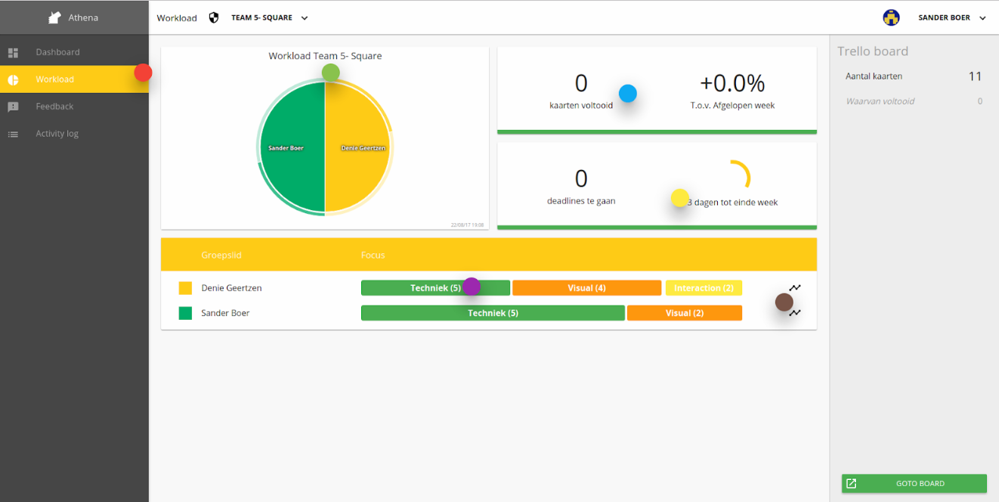

# Athena

_\*Ik heb de manuals ontvangen van David de Vries. Mijn inzichten van deze tool zijn dan ook gebasseerd op screenshots uit deze manual. Ik kon zelf niet aan de slag met deze tool, omdat deze niet meer online stond._

De tool Athena is gemaakt als afstudeerproject voor CMD. Deze tool was een plugin voor de applicatie Trello. Aan de hand van een dashboard kun je de voortgang van de trello kaarten bijvoorbeeld to do's analyseren. De gebruiker kreeg de mogelijkheid om aan te tonen wat zijn bijdrage aan het project was. Daarnaast hebben de studenten de mogelijkheid om feedback aan elkaar te geven. Aan de hand van een samenwerkingscontract stelde de projectgroep afspraken op die nageleefd moesten worden tijdens het project. Ook hadden zij de mogelijkheid om eigen afspraken toe te voegen en hier een categorie aan te koppelen. Deze tool bied inzicht voor mij in waar de studenten al mee gewerkt hebben en wat er nog verbeterd kan worden.

## Wat is goed aan deze tool?

Athena heeft raakvlakken met mijn project op het gebied van feedback. Studenten krijgen de mogelijkheid om elkaar feedback te geven in een groepje op basis van hoe zij het in die week gedaan hebben. Op deze manier krijgt de student meer inzicht in hoe zijn houding is tijdens dat project. 

* Studenten kunnen onderling de workload verdelen aan elkaar en hier afspraken over maken. Dit is inzichtelijk gemaakt door middel van data visualisatie. Door de datavisualisatie krijgen de studenten meer inzicht in hun ontwikkeling
* Studenten maken onderling afspraken die gelden tijdens hun project. Zij kunnen elkaar daarop beoordelen
* Studenten kunnen zichzelf een beroepsprofiel aanmeten waarin zij kunnen werken tijdens dat project

## Wat kan ik concluderen uit deze tool?

Studenten zijn aan de slag gegaan met een ontwikkelingstool. Ze zijn in staat om elkaar te beoordelen op basis van hun gedragingen tijdens hun projecten. Om meer informatie te krijgen over wat de studenten vinden van deze tool heb ik een aantal studenten gesproken in de medialounge. David de Vries gaf aan dat de studenten die dit serieus inzetten ook echt een beter resultaat hadden op hun project. Ik heb een interview over deze tool met david gehouden. Deze is terug te vinden onder "interviews".

## Wat vonden de studenten van deze tool?

In de medialounge heb ik een aantal studenten gevraagd wat hun mening over deze tool was. Veelvoorkomende punten waren:

Positief:

* Ik krijg concreet inzicht in mijn eigen inzet
* Door middel van de data visualisatie zie ik goed hoe ik presteer
* Ik kan door deze inzichten sneller actie ondernemen wanneer iets niet goed gaat

Negatief:

* Als iemand feedback vergeet te geven heb jij daar last van in jouw eigen "lijn"
* Meningen / feedback in deze tool zijn niet onderbouwd. Dit wordt alleen gegeven door middel van een cijfer
* Athena geeft je geen mogelijkheid om concreet inzicht te krijgen in actiepunten voor de toekomst

## Conclusie

Een aantal studenten gaven aan dat zij af en toe vergaten om hun eigen beoordeling in te vullen. Dit ging dan ten kosten van hun eindresultaat. De beoordeling was namelijk gebasseerd op het aantal sterren dat jij ontvangen had. Een essentieel onderdeel om mee te nemen voor mijn project is dan ook het instellen van reminders en notificaties in de applicatie. Data inzicht in hoe de studenten het doen vinden ze erg relevant. Dit kan ik ook toepassen op mijn concept. Daarnaast is het erg belangrijk om er voor te zorgen dat de studenten hun feedback onderbouwen.

