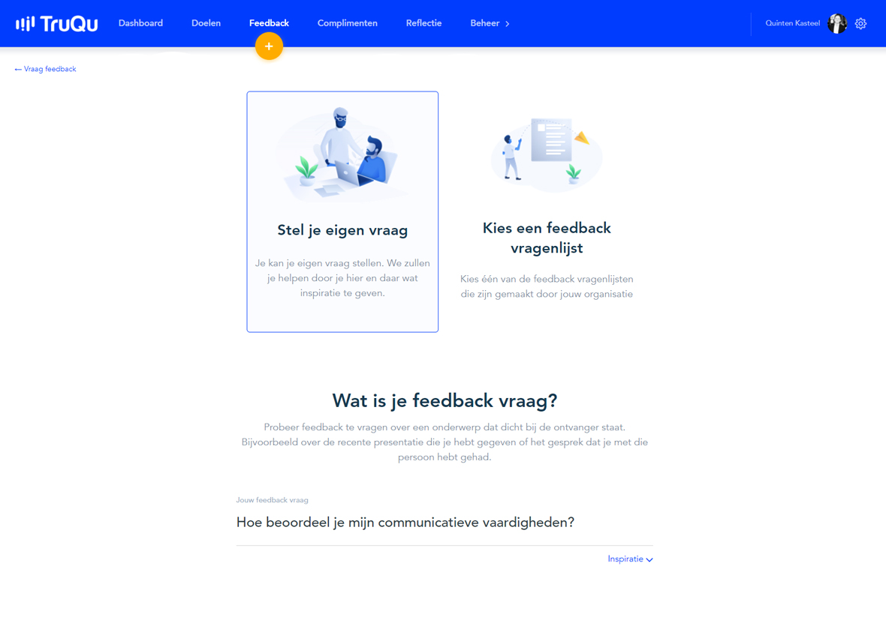

# TruQu

Voor de studentenversie van TruQu heb ik gekeken naar relevante functionaliteiten die gebruikt kunnen worden in de studenten versie. Ik heb alle functionaliteiten gemarkeert met een Must \(M\), Could \(C\), Should \(S\) of Won't \(W\) have. Alle must have's heb ik meegenomen naar mijn eigen concept. Niet elk onderdeel heeft een must, omdat deze niet in de focus van de 20 weken passen. Wellicht zijn sommige onderdelen daardoor niet minder belangrijk. Deze zijn geannoteerd met een Should \(S\)

### 1. Single Sign On \(M\)

De gebruikers van TruQu kunnen inloggen met Google of AFAS gegevens. Op deze manier hoeven zij niet constant hun login gegevens te onthouden en kunnen zij direct inloggen in de tool. Omdat studenten bij mij in moeten loggen met hun HvA gegevens zodat zij gemakkelijker feedback kunnen vragen aan medestudenten, is dit voor mij een essentieel onderdeel.

### 2. Feedback vragen \(M\)

Gebruikers van TruQu kunnen feedback vragen aan hun collega's, teamcoaches, admins en externen. Ze kunnen gebruik maken van een eigen vraag of een vragenlijst. Omdat uit mijn expert interview bleek dat het gebruik van een vragenlijst de student kan helpen met de juiste feedback te vragen en te ontvangen, is dit ook een belangrijk onderdeel. Wanneer een student op stage is en feedback wilt vragen, is het belangrijk dat hij dit kan doen via een e-mail adres. Daarom is het belangrijk dat een student ook feedback kan vragen aan externen.

### 3. Feedback geven \(M\)

Bij feedback vragen, hoort ook feedback geven. Waar TruQu zijn gebruikers niet echt helpt bij het geven van feedback, hebben studenten dat wel nodig. Het onderdeel feedback geven neem ik dus mee, maar hier moet nog iets meer hulp bij komen kijken

### 4. Reflectie \(M\)

Om er voor te zorgen dat de student aan de slag gaat met zijn feedback, is reflectie een belangrijk onderdeel. Dit zorgt er voor dat studenten nog eens nadenken over de feedback die hij ontvangen heeft de afgelopen tijd. Bij TruQu draait reflectie meer om 360 graden reflectie. Dus de gebruiker vult hem in, stuurt hem naar collega's en wordt vervolgens beoordeelt door een coach. Bij mijn tool is het wellicht relevanter dat de student alleen reflecteert op zijn eigen gedragingen. In de toekomst zou dit natuurlijk kunnen veranderen.

### 5. Doelen \(S\)

Wanneer een gebruiker feedback vraagt of reflecteerd, heeft dit vaak te maken met bepaalde leerdoelen. Om tot een eerste versie te komen heb ik deze functionaliteit niet meegenomen in de students version, maar zou in de toekomst een essentieel onderdeel kunnen worden van de applicatie. Feedback vragen, hierop reflecteren, nieuwe leerdoelen opstellen. Dat zou de ideale cirkel zijn.

### 6. Complimenten \(C\)

Complimenten is een functionaliteit die draait om positieve feedback. Het is een leuk onderdeel om toe te voegen, zeker om de studenten te motiveren om elkaar ook positieve feedback te geven. Dit onderdeel heb ik niet meegenomen in mijn onderzoek van de afgelopen 20 weken.

### 7. Portfolio \(C\)

In de app kan je een portfolio maken van al jouw ontvangen feedback en complimenten. Deze wordt gegenereerd tot een pdf. Dit zou een leuk onderdeel kunnen zijn voor de applicatie, maar is meer een "nice to have".

