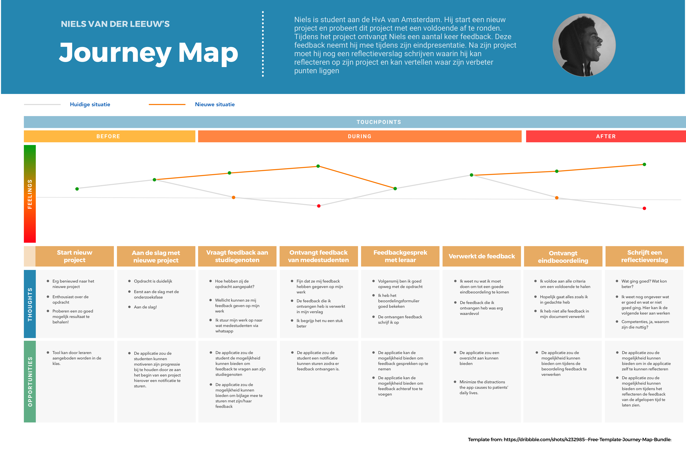

# Customer Journey

## Versie 1.0

Voor het in kaart brengen van de ervaring van de gebruiker heb ik een customer journey toegepast. Op de eerste versie heb ik in een later stadium ook de nieuwe situatie toegevoegd.

## Versie 2.0

Op basis van de feedback die ik heb gekregen tijdens de groenlicht presentatie heb ik een tweede versie gemaakt. Aan het einde van mijn Journey miste de stap voor het opstellen van nieuwe doelen. Dit maakt de cirkel rond. Vragen van feedback &gt; reflecteren &gt; nieuwe leerdoelen &gt; feedback etc.

