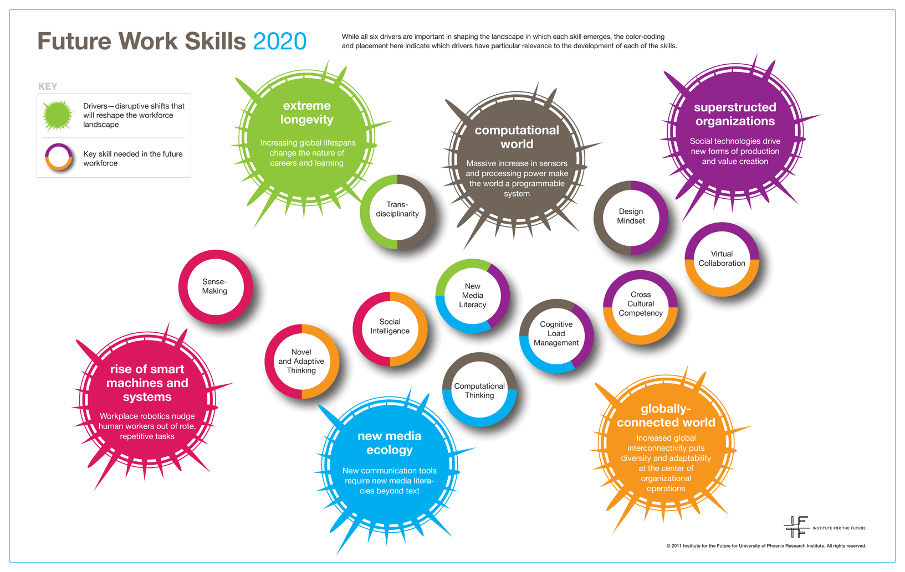

# Literature Study

Om mijn onderzoek in goede banen te leiden begin ik mijn project met het uitvoeren van een literature study. Ik ga opzoek naar interessante literatuur, artikelen en berichten over mijn onderwerp. Tijdens mijn  onderzoek werd mijn probleem al snel bevestigd. 

De belangrijkste resultaten hieruit zijn:

* Feedback bevordert de motivatie en het leren
* Competentieontwikkeling is erg belangrijk voor studenten voor de aansluiting op de arbeidsmarkt.
* Reflecteren, ondanks dat studenten dit een vervelend onderdeel vinden, is belangrijk in het leerproces van een student
* Doordat studenten elkaar beoordelen, leren ze ook kritischer te zijn op hun eigen werk.

## **Alle resultaten van de literature study zijn hier onder te vinden:** 

### **Wat is het effect van feedback?**

**Belangrijkste resultaat:**  
"Feedback kan het lesgeven, maar vooral het leren en de leerresultaten verbeteren. Feedback op de kwaliteit van het werk en het leerproces of de leerstrategie zijn het nuttigst. Positieve feedback, gericht op het werk en/of de leerstrategie, bevordert de \(intrinsieke\) motivatie en het leren."

[Bron:  
https://wij-leren.nl/effect-van-feedback-op-motivatie-en-leerresultaten.php](https://wij-leren.nl/effect-van-feedback-op-motivatie-en-leerresultaten.php)

**Jongeren: Aansluiting op de arbeidsmarkt moet beter:**

----------------------------------------------------------------------------------------------------------------------------------------------

### Wat is de waarde van de ontwikkeling van competenties voor studenten?

"Anderzijds moet je als opleidingsinstituut ook studenten voorbereiden op wat de arbeidsmarkt vraagt, namelijk meer competentiegerichte vaardigheden.  
  
****[https://www.ad.nl/ad-werkt/jongeren-aansluiting-op-arbeidsmarkt-moet-beter~a683d90e/](https://www.ad.nl/ad-werkt/jongeren-aansluiting-op-arbeidsmarkt-moet-beter~a683d90e/)

De arbeidsmarkt verandert. Zo ook de eisen die worden gesteld aan medewerkers binnen een organisatie. De competenties die gister belangrijk waren, zijn morgen overbodig. Natuurlijk is dit enigszins overdreven. Toch weerhoudt dat ons niet om deze belangrijke vraag te stellen: “Zijn we vandaag klaar voor de benodigde competenties van de toekomst?”

### **Toekomst vraagt om persoonlijke ontwikkeling**

Robots, autonoom transport, biotechnologie en kunstmatige intelligentie. Stuk voor stuk ontwikkelingen die vormgeven aan de manier waarop we leven en werken. Nu, maar zeker in de toekomst. Sommige beroepen verdwijnen zelfs of maken plaats voor nieuwe beroepen. Wat vaststaat is dat toekomstige medewerkers die langer willen blijven op de arbeidsmarkt, zich vaker aan moeten passen om te voldoen aan de benodigde capaciteiten. Zij hebben een leven lang leren voor zich.

### 1. Probleemoplossend denken

Computers nemen veel processen over. Denk aan bijvoorbeeld de productie van goederen of het automatiseren van diensten. Deze veranderingen zorgen voor een toenemende vraag naar vaardigheden waar computers juist niet goed in zijn. Dit zijn de denkvaardigheden die niet in codes omgezet kunnen worden. Bijvoorbeeld het analyseren, evalueren en het creëren van nieuwe ideeën of producten. Het menselijk inzicht is hier, gelukkig, nog steeds voor nodig.

Een competentie die hieraan ten grondslag ligt is het probleemoplossend vermogen. Hieronder verstaan we het vermogen om problemen te signaleren en een oplossing te creëren voor deze problemen. Doordat de wereld steeds complexer wordt, krijgen medewerkers vaker te maken met gecompliceerde vraagstukken. Het is belangrijk dat medewerkers dan in staat zijn de problemen te analyseren en het vraagstuk strategisch aan te pakken.

### **2. Samenwerkend vermogen**

In een volledig globaal verbonden wereld, worden medewerkers geacht in staat te zijn in elke omgeving te functioneren. Dit vergt taalvaardigheden en aanpassingsvermogen. Maar doet ook een beroep op het samenwerkend vermogen.

Het onderzoek van the Institute for the Future wijst uit dat een innoverende groep medewerkers bestaat uit een combinatie van verschillende leeftijden, vaardigheden, disciplines en manieren van denken. Medewerkers met een sterke samenwerkend capaciteiten weten om te gaan met de verschillen binnen een diverse groep. Daardoor komen zij gezamenlijk tot een hoger niveau.

### **3. Sociale intelligentie**

In de toekomst zullen steeds meer processen zijn geautomatiseerd. Maar, gelukkig leggen computers het nog altijd af tegen menselijke vaardigheden op een aantal onderdelen. Voornamelijk op het sociale gebied en het begrijpen van emoties. Dat brengt ons op competentie drie: sociale intelligentie.  

Sociale intelligentie is het begrijpen wat verschillende doelgroepen willen en wat hen aanzet tot actie. Het is belangrijk om te komen tot de kern van de wensen en behoeften van deze doelgroepen. Dan kun je namelijk snel reageren op hun afgegeven signalen. Computers zijn nog niet volledig in staat sociale intelligentie toe te passen. Daarom blijven medewerkers hierin belangrijk. Jouw medewerkers zijn namelijk in staat om emoties van anderen op te vangen en het gedrag, de toon en woorden te plaatsen in de context van hun omgeving.

### **4. Creativiteit**

Creativiteit is de vierde competentie die alleen maar belangrijker wordt in de toekomst. Om als organisatie de concurrentie voor te zijn, is creativiteit een vereiste. Het helpt bij het bedenken van nieuwe werkwijzen, verbeteringen en originele ideeën en zorgt dat de organisatie opvalt in de menigte.

Met creatieve medewerkers in dienst, sta je als organisatie open voor andere benaderingswijzen. Daarnaast ben je in staat om iets op meerdere manieren uit te voeren. Je denkt als organisatie buiten bestaande kaders. Hierdoor ontstaan verrassende oplossingen die sterk afwijken van de gebruikelijke benadering.

Deze competentie bezitten sommige medewerkers al van nature. Toch gaat hier veel tijd en inzet mee gemoeid. Creativiteit kun je trainen door te oefenen in denktechnieken zoals brainstormen en mindmapping.

### **5. Computational thinking**

Computational thinking houdt in het verweken van datagegevens en het omzetten van deze gegevens in concepten. Met de digitalisering en technologisering komt steeds meer en specifiekere data de organisatie binnen. De juiste digitale tools inzetten en uitdagingen vertalen naar concepten in een snel veranderende digitale omgeving, vraagt om uitgebreide kennis van dataverzameling en dataverwerking. Medewerkers die dit goed kunnen, worden alsmaar waardevoller voor innovatieve organisaties.

Naast het ontwikkelen van computational thinking vaardigheden, moeten medewerkers zich bewust zijn van de beperkingen. Zo zijn de gebruikte modellen zo goed als de data die gebruikt wordt in het model. Houd daarom in het achterhoofd dat zelfs de beste modellen een benadering van de realiteit zijn en niet de realiteit zelf. Daarnaast moeten medewerkers in staat zijn om ook te kunnen handelen in de afwezigheid van de juiste data en niet in paniek te raken wanneer een algoritme in het proces ontbreekt.

### **6. Inzicht in nieuwe media** 

Het belang van verschillende communicatiekanalen wordt in de toekomst groter en groter. Vooral content die de gebruiker genereert, neemt een prominentere plek in in het bedrijfsleven. Denk aan bijvoorbeeld video’s, blogs en podcasts. De statische vormen van communicatie \(bijvoorbeeld een PowerPoint presentatie\) maken plaats voor meer interactieve vormen van communicatie.

De toekomst verwacht dat medewerkers verschillende nieuwe media managen op eenzelfde manier als de papieren informatie van nu. Medewerkers moeten steeds meer in staat zijn om hun eigen visuele informatie te creëren en te presenteren. Op deze manier genereren zij namelijk betrokkenheid onder hun doelgroep. Hierdoor is het bezitten van geavanceerde vaardigheden om met deze creatieve tools om te gaan alleen maar belangrijker.**7. Multidisciplinair**

Multidisciplinariteit is het hebben van de kennis en de vaardigheden om concepten te begrijpen die meerdere disciplines omvatten. In de 20ste eeuw was het normaal om als medewerker gespecialiseerd te zijn in één bepaald onderwerp of discipline. In de toekomst verwachten organisaties juist dat medewerkers een combinatie van disciplines beheersen.

The Institute for the Future omschrijft de ideale werknemer van het volgende decennium als ‘T’-vormig. Zij hebben extensieve kennis van minimaal één onderwerp, maar kunnen deze kennis vertalen naar een breder scala aan disciplines. Neem bijvoorbeeld een HR-manager. Naast dat de HR-manager alles af weet van recruitment, wordt het belangrijk dat zij ook kennis hebben over onderwerpen zoals talentmanagement, de meest recente ontwikkelingen op opleidingsgebied, wet- en regelgeving, CRM-systemen of data-analyses.

### **8. Efficiënte informatieverwerking**

Via verschillende communicatiekanalen komt een oneindige stroom aan informatie op ons af. Het is lastig om al deze informatie optimaal te verwerken. Daarom is het belangrijk dat medewerkers snel de juiste informatie filteren uit deze grote stroom. Gezien de voorspelde toename van informatie, wordt dit alleen maar lastiger in de toekomst. Daarom beschouwen we efficiënte informatieverwerking als belangrijke competentie in 2020.

De nieuwe generatie medewerkers moeten bedreven raken in het werken met nieuwe tools. Daarnaast moeten zij nieuwe technieken kunnen ontwikkelen om cognitieve overdosis te voorkomen. Denk bijvoorbeeld aan technieken als sociaal filteren - het ordenen en taggen van data zodat hogere kwaliteitsinformatie wordt gescheiden van de overige ruis.

### **Competentieontwikkeling is ook nu al belangrijk**

Kijkende naar bovenstaande competenties van de toekomst valt op dat de meeste nu ook al van belang zijn. 2020 is dan ook niet ver weg meer. De genoemde competenties worden echter steeds onmisbaarder. Dit omdat de digitalisering en technologisering verder doorzetten. Je kunt zeggen dat we momenteel in een soort overgangsfase zitten. Medewerkers komen nu nog weg met een gebrek aan bepaalde competenties. In 2020 wordt dat anders. Dan ontkomen ze niet meer aan de grote stroom aan data of de overlap van disciplines.

[http://www.iftf.org/futureworkskills/](http://www.iftf.org/futureworkskills/)  
[https://www.studytube.nl/blog/8-competenties-van-de-toekomst-onmisbaar-voor-medewerkers-in-2020](https://www.studytube.nl/blog/8-competenties-van-de-toekomst-onmisbaar-voor-medewerkers-in-2020)

**----------------------------------------------------------------------------------------------------------------------**

\*\*\*\*

## **Waarom is reflectie belangrijk voor studenten?**

"Vaak blijft reflectie van studenten steken op het niveau van evaluatie, wordt er te veel op persoonlijke problemen gefocust en wordt er onvoldoende geabstraheerd. Het gevolg hiervan is dat studenten reflectie saai en vervelend gaan vinden en het reflectieverslag behandelen als een invullijstje. Maar reflectie is noodzakelijk om praktijk te koppelen aan theorie, zich bewust te worden van de eigen leerprocessen en om inzicht te krijgen in de gevolgen van beroepsmatig handelen"  
  
[https://reflectiesite.nl/wp-content/uploads/2016/05/Reflectie\_als\_drijfveer.pdf](https://reflectiesite.nl/wp-content/uploads/2016/05/Reflectie_als_drijfveer.pdf)  

**Studenten slaan alarm over aansluiting studie op werk:**

Voor het hbo is de aansluiting tussen opleidingen en de arbeidsmarkt slechter geworden, blijkt uit onderzoek dat het Research Centrum Onderwijs en Arbeidsmarkt \(ROA\) dinsdag heeft gepubliceerd. Een kwart van de hbo’ers noemt de aansluiting ook onvoldoende. Er zou sprake zijn van een „matiger aansluiting met de gevolgde opleiding”"  
  
[https://www.nrc.nl/nieuws/2017/09/05/uit-met-de-pretstudies-studeer-slim-12851188-a1572358](https://www.nrc.nl/nieuws/2017/09/05/uit-met-de-pretstudies-studeer-slim-12851188-a1572358)

**Reflecteren: Leuker kunnen we het wel maken!**

"Studenten worden vrijwel vanaf de eerste dag dat zij aan hun studie beginnen verplicht tot zelfreflectie, maar het is voor veel studenten niet duidelijk wat reflecteren precies is en hoe ze het moeten doen. Terwijl ze wel heel goed naar zichzelf kunnen kijken en het maken van selfies ze bijzonder goed afgaat, is zelfreflectie toch andere koek.**"**  
  
[https://www.fontysaci.nl/nieuws/what-s-happening-reflecteren-leuker-kunnen-we-het-wel-maken](https://www.fontysaci.nl/nieuws/what-s-happening-reflecteren-leuker-kunnen-we-het-wel-maken)

**------------------------------------------------------------------------------------------------------------------------**

### **Waarom is peerfeedback een belangrijk onderdeel voor studenten?**

**Peerfeedback: Hoe effectief is het?**

**"**Het krijgen van feedback van mede-leerlingen leidt niet direct tot betere prestaties. Maar David Nicol \([2011](http://www.enhancementthemes.ac.uk/docs/publications/developing-students-ability-to-construct-feedback.pdf)\) geeft zes argumenten waarom juist het _geven_ van peerfeedback leerzaam is:

1. **Actief leren** — Wanneer leerlingen feedback krijgen, van docent of mede-leerling, hebben ze de passieve rol. Wanneer ze feedback geven hebben ze de actieve rol. Het formuleren van feedback is een ander cognitief proces dan het lezen van gekregen feedback.
2. **Actief gebruiken van criteria** — Bij het geven van peerfeedback moeten leerlingen actief oordelen over kwaliteit, in relatie tot de criteria en dit onderbouwen. Ze worden gedwongen na te denken over de criteria. Dat is iets anders dan kennis nemen van gedeelde criteria.
3. **Wederkerigheid** — Leerlingen worden leerbronnen voor elkaar. Ze lezen werk van elkaar en zien hoe andere leerlingen dingen aanpakken. Ze zien dat er niet één goed antwoord is, kwaliteit kent vele gezichten. En door het geven en krijgen van peerfeedback hebben de leerlingen een verantwoordelijkheid naar elkaar, voor het werk van anderen, maar ook voor hun eigen werk.
4. **Domein-expertise** — Door regelmatig te moeten oordelen over verschillend werk van verschillende medeleerlingen ontwikkelingen bredere kennis doordat ze de rol van de expert innemen.
5. **Leren van elkaar** — Wanneer leerlingen gewend raken aan het werken met peerfeedback, kan dit de sociale cohesie versterken en van de groep een leergemeenschap maken.
6. **Zelfevaluatie versterken** — Kritisch naar werk van andere kijken is makkelijker dan kritisch naar eigen werk te kijken. Toch is het één en dezelfde vaardigheid. Wanneer leerlingen gewend zijn om te oordelen over werk en hierbij criteria te gebruiken, worden ze ook beter om kritisch te oordelen over eigen werk."  [https://www.vernieuwenderwijs.nl/peerfeedback/](https://www.vernieuwenderwijs.nl/peerfeedback/) [https://www.enhancementthemes.ac.uk/docs/ethemes/graduates-for-the-21st-century/developing-students-ability-to-construct-feedback.pdf?sfvrsn=a43df981\_8](https://www.enhancementthemes.ac.uk/docs/ethemes/graduates-for-the-21st-century/developing-students-ability-to-construct-feedback.pdf?sfvrsn=a43df981_8)

  

### Usabillity testing  [https://www.frankwatching.com/archive/2012/08/27/usability-testing-goede-voorbereiding-is-het-halve-werk/](https://www.frankwatching.com/archive/2012/08/27/usability-testing-goede-voorbereiding-is-het-halve-werk/)

### Testplan 



### Pushnotificaties: waarom zijn die belangrijk?

[https://www.business2community.com/infographics/the-growing-importance-of-mobile-app-push-notifications-infographic-02096198](https://www.business2community.com/infographics/the-growing-importance-of-mobile-app-push-notifications-infographic-02096198)  
[https://www.sketchappsources.com/free-source/2586-ios-push-notifications-template-sketch-freebie-resource.html](https://www.sketchappsources.com/free-source/2586-ios-push-notifications-template-sketch-freebie-resource.html)

\*\*\*\*

\*\*\*\*

