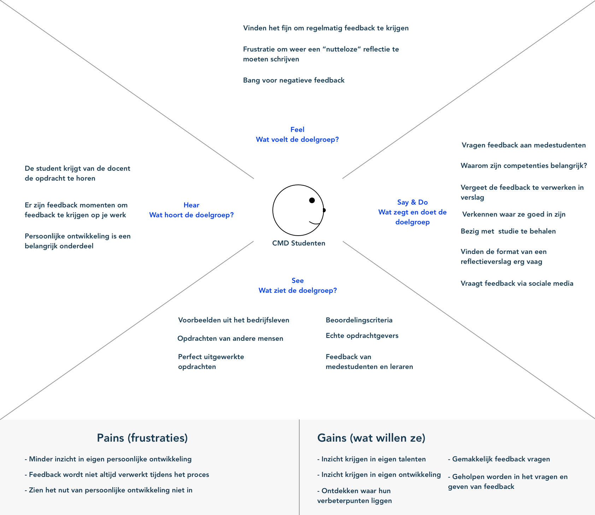

# Empathy Map

Alle resultaten van mijn interviews heb ik meegenomen in een Empathy Map. Met de Empathy Map breng ik in kaart wat de gebruiker voelt, zegt, doet, waar hun pijnpunten zitten en wat ze zouden willen. Door dit ik kaart te brengen krijg je een helder beeld van de probleemsituatie.

