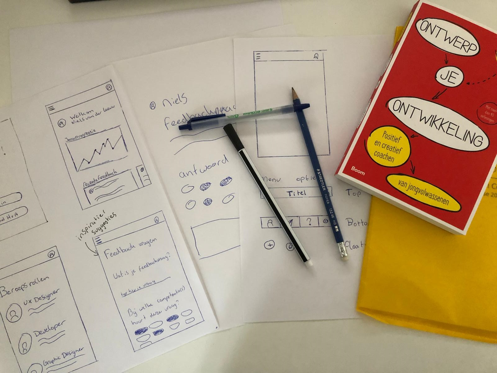
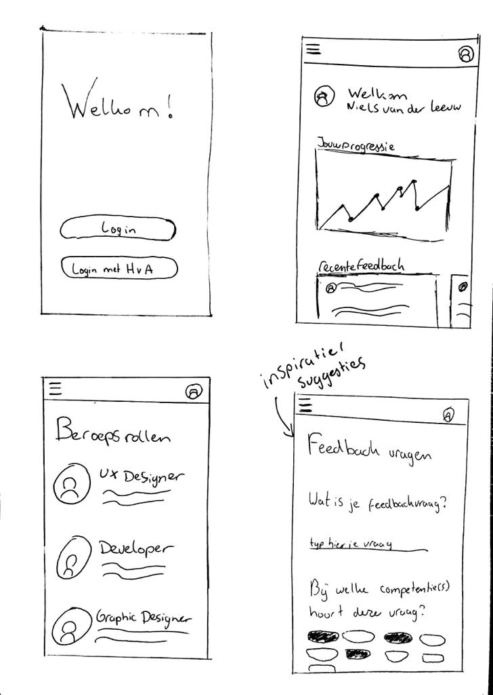

# Sketching

Op basis van mijn \(expert\) interviews en mijn literature study ben ik aan de slag gegaan met de eerste ideeën op papier te zetten. Ik heb een belangrijke onderdelen geschetsts van mijn applicatie waar ik vervolgens mee naar de doelgroep toe kan gaan. Door middel van de schetsen te presenteren aan mijn doelgroep kan ik er achter komen welk idee wel zou kunnen werken en welke niet.

De belangrijkste schermen:

* Home / persoonlijke groei
* Feedback geven door middel van het selecteren van onderwerpen
* Feedbackapplicatie homescreen met koppeling HvA
* Beroepsrollen.

De eerste schetsen:

