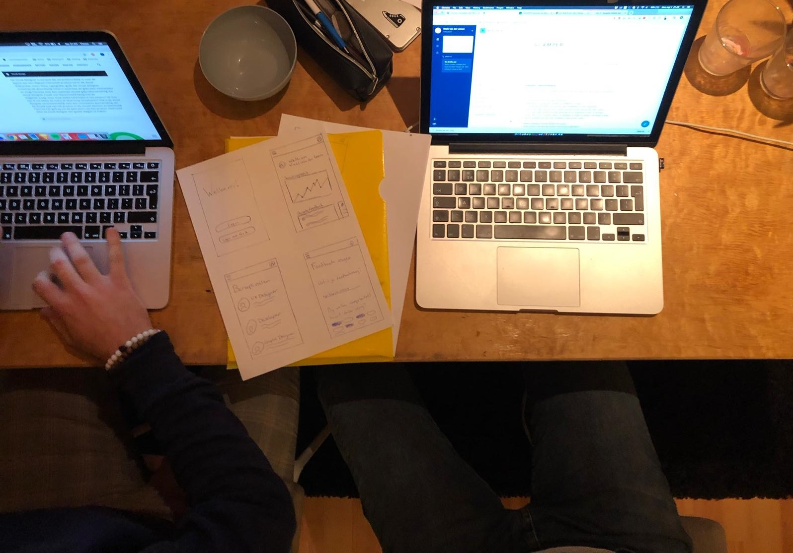

# S.C.A.M.P.E.R

Op maandag 1 april 2019 heb ik een S.C.A.M.P.E.R uitgevoerd met Timon Tlomaczewski. Timon is een vierde jaars student op CMD Amsterdam. Ik heb aan Timon mijn eerste schetsen en ideeën laten zien van mijn concept, en op basis hiervan zijn wij aan de slag gegaan met de methode.

**Voorwoord: Wat vind je van de ideeën die ik uitgetekend heb?**  
_Ik vertel Timon een aantal ideeën die ik uitgeschetst heb om op basis daarvan de scamper te kunnen houden_

* Intressant concept, ik zou dit wel willen gebruiken tijdens mijn opleiding om mijzelf beter te ontwikkelen
* Het onderdeel persoonlijke groei vind ik erg belangrijk. Als ik straks afstudeer heb ik eigenlijk alleen een design portfolio, maar ik zou het ook intressant vinden hoe ik mij als persoon ontwikkelt heb
* Het vragen van feedback is vrij duidelijk, ik zou wel de mogelijkheid willen hebben om zelf ook nog “onderwerpen” toe te voegen, zodat ik daar nog meer nuttige feedback mee kan geven.
* Het inloggen met je HvA gegevens kan denk ik erg waardevol zijn. Dat zou net zo kunnen werken als het toevoegen van je roosters op de HvA website. Zo zou je je klas kunnen koppelen aan je account en mensen feedback kunnen vragen die in je klas zitten.
* Ik denk dat van alle onderdelen die je in gedachte hebt, feedback en persoonlijke groei het belangrijkste zijn.

\*\*\*\*

## **S.C.A.M.P.E.R**

**Substitute – plaatsvervanging**

**Welk ander product kan gebruikt worden?**  

* Whatsapp zou je kunnen inzetten om feedback te vragen
* Voor de beroepsrollen zou je ook de CMD handleiding kunnen raadplegen
* Je zou wat meer met je SLCer in contact kunnen komen, die jou wat meer coacht
* Je zou een eigen portfolio kunnen bijhouden om je progressie in kaart te brengen
* Je zou een forum in kunnen zetten om feedback te vragen en ideeen met elkaar te delen
* Je zou op platformen als Fiverr/Dribbble je werk kunnen tonen 

**Combine – combineren**

Wat gebeurt er als het product gecombineerd wordt met een ander product? Ontstaat er dan een nieuw eindproduct?

* Als je zou kunnen chatten met bijvoorbeeld leraren wordt het meer een applicatie waarbij de SLC coaching centraal staat
* Als je dit zou combineren met meerdere opleidingen zou dit een soort opleidings keuze tool / coaching kunnen worden
* Als je gamification inzet, wordt het een soort spel. Hier komen RPG game-elementen bij kijken. Dit zou bijvoorbeeld uitstelgedrag kunnen voorkomen omdat je dingen kunt unlocken.
* Als je het combineerd met de HvA applicatie, zou je sneller inzicht kunnen krijgen in jouw behaalde cijfers en vakken 

Kan het product ook voor een ander doel gebruikt worden?  

* SLC Gesprekken
* Motivatie om bezig te zijn met je studie/ontwikkeling
* Het kan ingezet te worden om in een klas feedback momenten ingeplant te worden. Een leraar kan bijvoorbeeld aan het einde van een blok feedback geven op mijn ontwikkeling. 
* Het kan ingezet worden voor peer-to-peer reviews, waarbij je met elkaar kijkt naar elkaars werk, waardoor je weer leert van elkaar.
* Je zou een feedback request neer kunnen leggen in jouw klassengroep, waarbij je een soort feedback trade krijgt. Dus ik geef jou feedback en jij mij.

**Adapt – aanpassen**  

In welke andere context kan het product geplaats worden?  

* Je zou een soort van portfolio kunnen aanleveren aan bedrijven met deze applicatie, waarbij zij tijdens een sollicitatie inzicht krijgen in jouw ontwikkeling. Hierbij is de feedback een referentiepunt.
* De tool zou ingezet kunnen waardoor leraren feedback vragen over hun manier van lesgeven etc.
* De tool zou ingezet kunnen worden om de opleiding te verbeteren  

  **Modify/ Magnify – wijzigingen**  

  Hoe zou de vorm of het uiterlijk van het product veranderd kunnen worden?  

* Je zou de feedback in een presentatie/kahootvorm kunnen verwerken waarbij mensen live op het scherm feedback kunnen geven op jouw designs/werk.

Wat kan aan het product worden toegevoegd?  

* Gamification kan je erg motiveren om aan de slag te gaan met feedback
* Je zou een soort persoonlijkheidstest kunnen vullen, waarbij jij kan terugzien wat op dat moment voor jou de ideale beroepsrol is. Daarnaast kan je dit ook linken aan je resultaten, waardoor je kunt zien waar je je daarop op dat moment aan het ontwikkelen mee bent 

Wat zou aan het product benadrukt kunnen worden om zo meer waarde te creëren?  

* Veel positiviteit en motiveren
* Je persoonlijke groei moet veel benadrukt worden

  
Wat zou je niet willen zien?

* Content van andere mensen waardoor jij onzeker kan worden over jouw eigen ontwikkeling. 

**Purpose – voor een ander gebruik inzetten**

Door wie zou dit product nog meer kunnen worden gebruikt?

* Het product zou gebruikt kunnen worden door leraren om feedback te geven op leerlingen hun werk
* Het product kan ingezet worden voor leraren onderling om feedback te geven aan elkaar
* Het product kan ingezet worden tijdens stagemarkten zodat stagebedrijven dezelfde format per kandidaat krijgen, waardoor ze makkelijker kunnen vergelijken

**Eliminate/ Minify – elimineren / weglaten**

Hoe zou dit product eruit zien als het vereenvoudigd wordt?  

* Het product zou kunnen dienen om alleen leraren de mogelijkheid te geven om feedback te geven, niet door de gebruikers \(peers\) zelf.
* Het zou een soort beroepsrollen applicatie kunnen worden, waarbij leerlingen geholpen worden in hun studiekeuze

Welke functies en/of onderdelen kunnen worden weggelaten?

* De beroepsrollen

Hoe kan het product kleiner, sneller of lichter gemaakt worden?  

* Zo min mogelijk menu's / schermen.
* Door handvaten aan te bieden om bijvoorbeeld makkelijker feedback te vragen.
* Door in te kunnen loggen met je schoolgegevens
* Door het automatisch te koppelen met je schoolgegevens
* Dat er zoveel mogelijk wat er al bekend is, ingevuld is. \(bijvoorbeeld hoe vaak er feedback gevraagd word\)
* Dat je bepaalde dingen zou kunnen voltooien/verwijderen. Bijvoorbeeld bij een beroepskeuze.
* De mogelijkheid hebben om je eigen pushnotificaties in te stellen
* De mogelijkheid hebben om direct tot alle functionaliteiten te beschikken
* Gebruik maken van microinteracties
* De gebruiker niet te veel keuze geven. Het meer geisoleerd laten

**Rearrange/ Reverse – omgekeerde**

Wat gebeurt er als het product wordt omgedraaid?  

* Destructieve feedback, waardoor je scherper wordt en je eigen fouten inziet.
* Met de beroepsrollen zou je er achter kunnen komen wat je juist niet wilt worden door aan te geven wat er bij komt kijken om dit te doen
* Aangeven waar je niet goed in bent, zodat je weet waar je aan moet werken 

