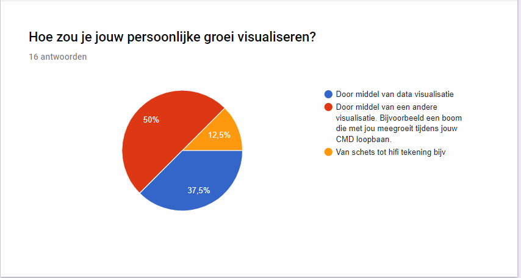

# Survey

## Persoonlijke groei

Omdat vanuit mijn expert interviews bleek dat het in kaart brengen van persoonlijke groei een essentieel onderdeel is, heb ik hier een survey voor uitgezet. Om de ontwikkeling van de student in kaart te brengen heb je hier een aantal mogelijkheden voor. Op aanraden van mijn begeleider Marianne heb ik

Ik heb onder de studenten van CMD een enquete gehouden op wat voor manier zij hun eigen persoonlijke groei zouden willen visualiseren.

Naast de survey heb ik een poll gehouden op facebook in de CMD groep van mijn jaarlaag.

Als ik alle antwoorden samenvat kom ik terecht op

* Visualisatie door middel van een afbeelding / groeiende boom - 12 stemmen
* Visualisatie door middel van data visualisatie - 23 stemmen

Studenten van CMD hebben dus duidelijk een voorkeur om door middel van datavisualisatie inzicht te krijgen in hun ontwikkeling. Ook is er een groep die de visualisatie door middel van de groei van een boom interessant vind. Ik heb beide onderdelen gecombineerd en uitgewerkt in een scherm. Deze neem ik mee naar mijn usabillity tests.

