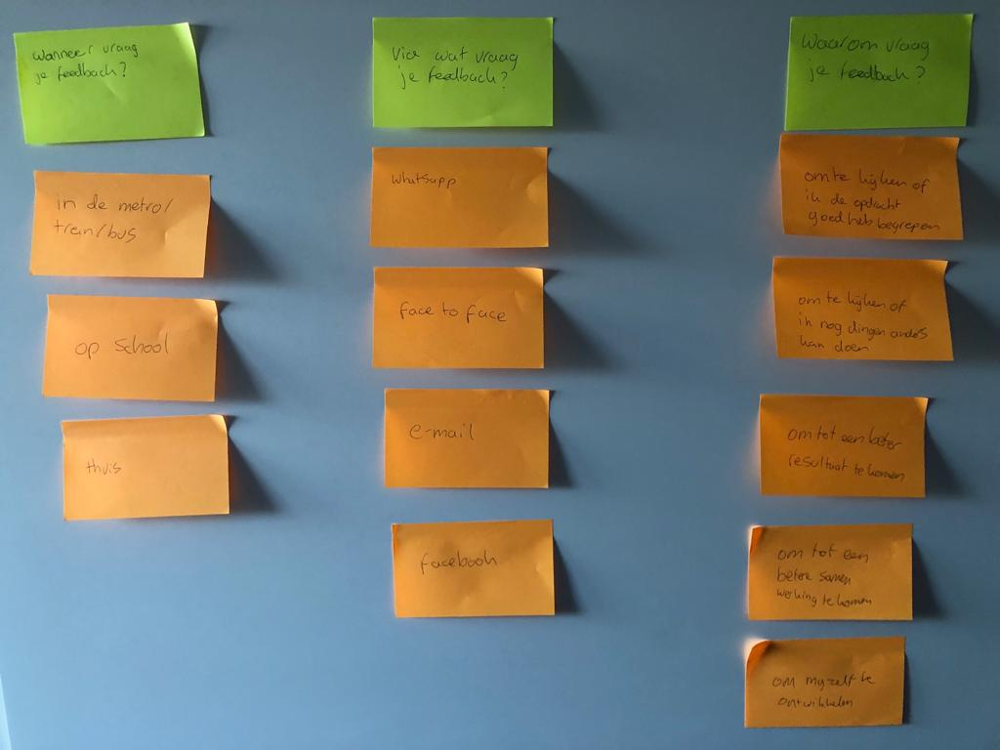

# Korte vragenronde medialounge

Om iets meer context te krijgen over het vragen en geven van feedback heb ik een korte vragenronde gehouden in de medialounge. Ik ben langs alle studenten gelopen en heb hun een aantal snelle en korte vragen gesteld.

De meest voorkomende antwoorden heb ik uitgewerkt door middel van sticky notes.

De resultaten:

Wanneer vraag je feedback?

* In de trein/metro/bus als ik onderweg ben naar huis op een opdracht of iets dergelijks
* Als ik op school in de medialounge ben
* Als ik thuis ben

Via wat vraag je feedback?

* Face to face
* Via Whatsapp
* Via e-mail

Waarom vraag je feedback?

* Om te kijken of ik de opdracht goed heb begrepen
* Om te ondervinden of ik dingen anders kan doen
* Om tot een beter resultaat te komen
* Om beter te kunnen samenwerken
* Voor mijn ontwikkeling

Met deze inzichten ben ik aan de slag gegaan met het opzetten van interviews. Ik heb een interview gepland met:

Jorn van 't Hof \(Jaar 2\)  
Dennis Vens \(Langstudeerder, jaar 2\)  
Remy Gast \(Ex-CMD\)  
Michel Alders  
Jos Kok  
David de Vries  
Hein Bijvoet

Deze interviews zijn onder deze pagina terug te vinden.

