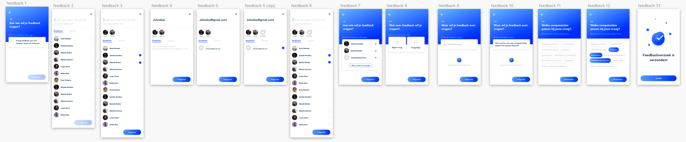

# Concept

Mijn concept is een feedback tool waarmee studenten feedback kunnen vragen aan leraren, medestudenten en externen. Daarnaast kunnen de studenten ook reflecteren op hun ontvangen feedback en inzicht krijgen in hun talenten.

Dit zijn de features van mijn product:

1. Feedback vragen.

Een student kan feedback vragen aan leraren, medestudenten en externen. Aan de feedback vraag kunnen competenties gekoppeld worden. Ook kan een student eventueel een foto of pdf meesturen.

 

2. Feedback geven.

De student ontvangt feedback verzoeken van andere en kan deze feedback geven. De student geeft feedback op basis van feedback onderwerpen. Dit zijn kernwoorden die passen bij de feedback. De student heeft de mogelijkheid om eigen onderwerpen toe te voegen. Op basis van zijn gekozen onderwerpen geeft de student een toelichting.

3. Reflectieverslag maken

De student kan reflecteren op zijn ontvangen feedback. De student geeft een titel aan zijn reflectieverslag en geeft een periode aan waarop hij wilt reflecteren. Vervolgens selecteert de student een reflectie vragenlijst. De feedback van die periode wordt ingeladen en de meest voorkomende feedback onderwerpen van die periode. Deze verzameling helpt de student bij het schrijven van een reflectieverslag

4. Persoonlijke groei

De student kan zijn eigen persoonlijke groei terug zien. Bovenin staat een boom. Deze boom groeit op basis van de gevraagde feedback. Elke tak staat voor een competentie. Hoe meer de student zich ontwikkelt op een competentie, hoe voller de tak wordt. Onder deze boom vind de student een aantal datainzichten. Eerst krijgt de student zijn activiteit te zien. Hierin kan hij aflezen hoeveel hij de applicatie inzet. Onder deze grafiek ziet de student datainzicht van zijn competenties. Per competentie ziet hij terug wat de veelvoorkomende feedback onderwerpen zijn.

