# Design Pattern Search

Selecteren van studenten / leraren   
Applicatie: Whatsapp  
Source: [https://img.gadgethacks.com/img/31/34/63638034983932/0/whatsapp-101-broadcast-messages-multiple-contacts.w1456.jpg](https://img.gadgethacks.com/img/31/34/63638034983932/0/whatsapp-101-broadcast-messages-multiple-contacts.w1456.jpg)

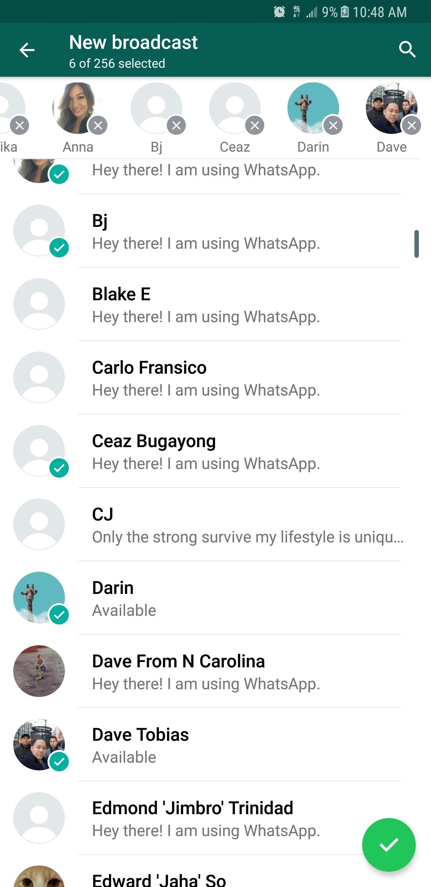

Menu:  
  
Voor het menu gebruik ik het pattern van een aantal tabs. Op deze manier kan de gebruiker altijd direct bij alle functionaliteiten van de applicatie, en wordt de content niet verborgen.   
  
Ook hou ik met dit pattern rekening met de grootte van de telefoons van tegenwoordig. Ook Apple stapt af van het standaard 4-5 inch scherm en begint de schermgrootte op te schroeven. 

Source: [https://dribbble.com/shots/5315582-Tabbar-Exploration](https://dribbble.com/shots/5315582-Tabbar-Exploration)

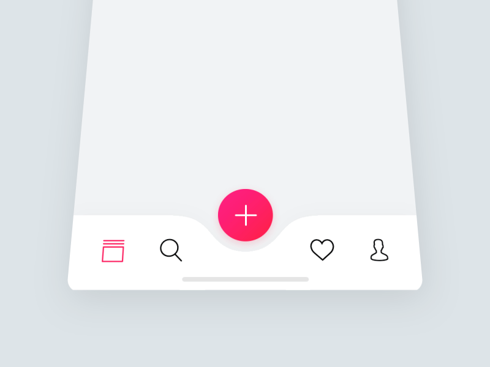

Menu  
App: Myfitnesspal  
Source: [http://human.co/posts/human-myfitnesspal.html](http://human.co/posts/human-myfitnesspal.html)

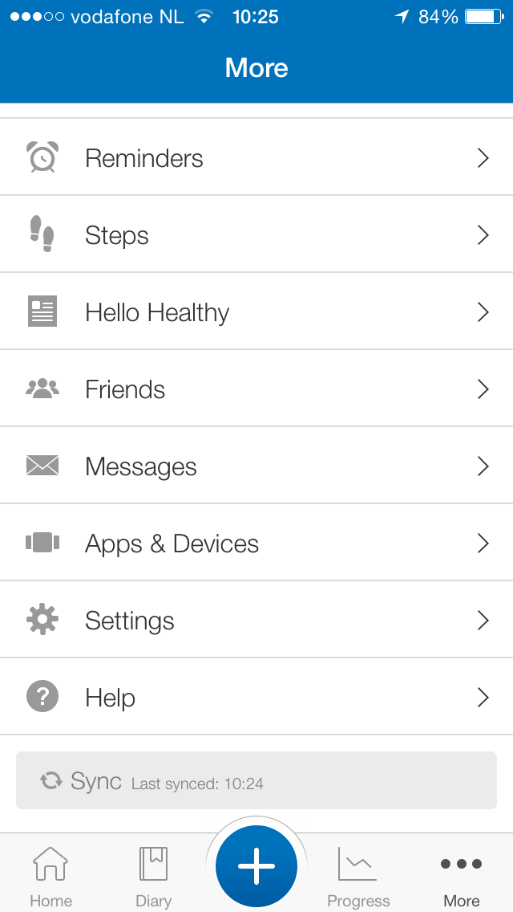

Feedback onderwerpen/competenties selecteren  
Source: [https://dribbble.com/shots/4802020-Create-Workout-Filters](https://dribbble.com/shots/4802020-Create-Workout-Filters)

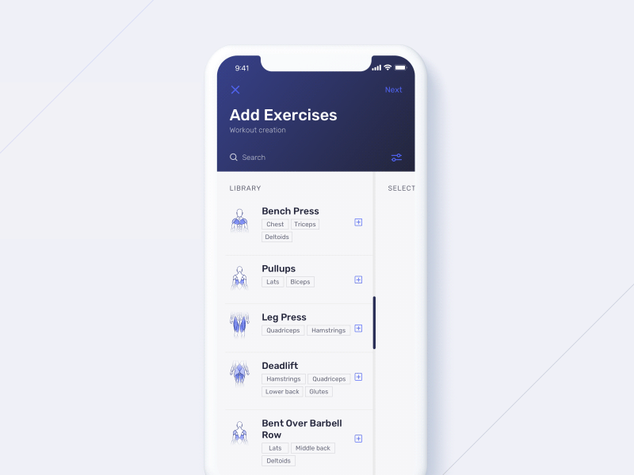

Competenties & onderwerpen  
Source [https://dribbble.com/shots/2577700-Drag-and-drop-categories](https://dribbble.com/shots/2577700-Drag-and-drop-categories)

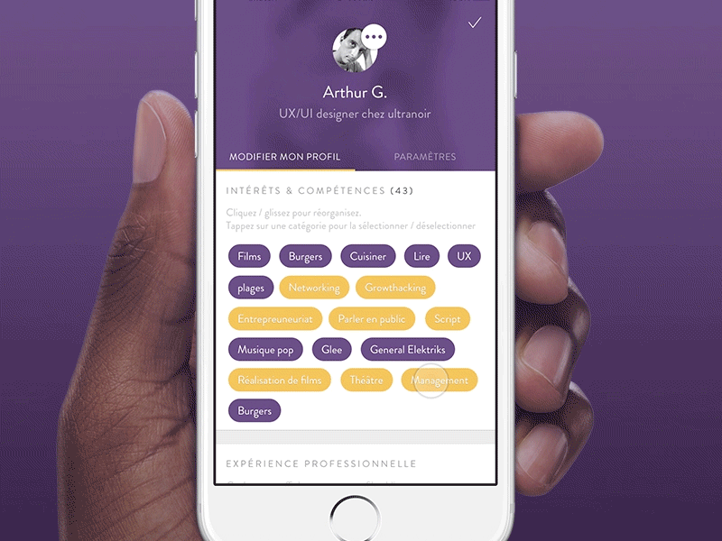

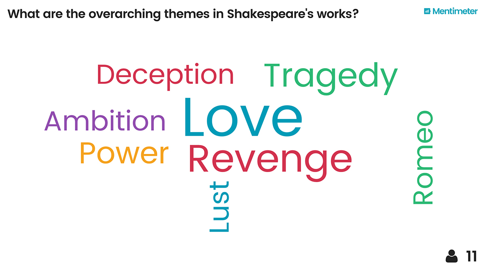

Reflectie woorden terugzien

Source: [https://www.mentimeter.com/features/word-cloud](https://www.mentimeter.com/features/word-cloud)

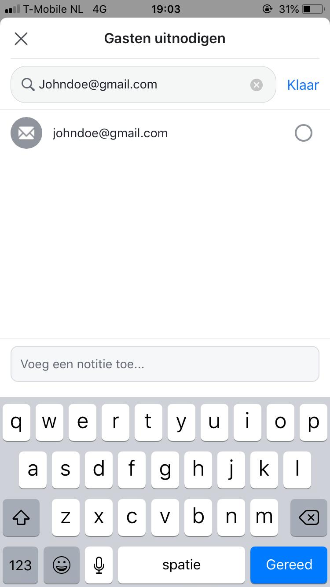

Toevoegen van externen  
Source: Facebook app

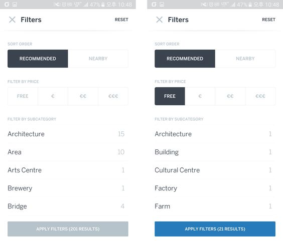

Filters  
Source: [https://uimovement.com/design/travel-filter/](https://uimovement.com/design/travel-filter/)  

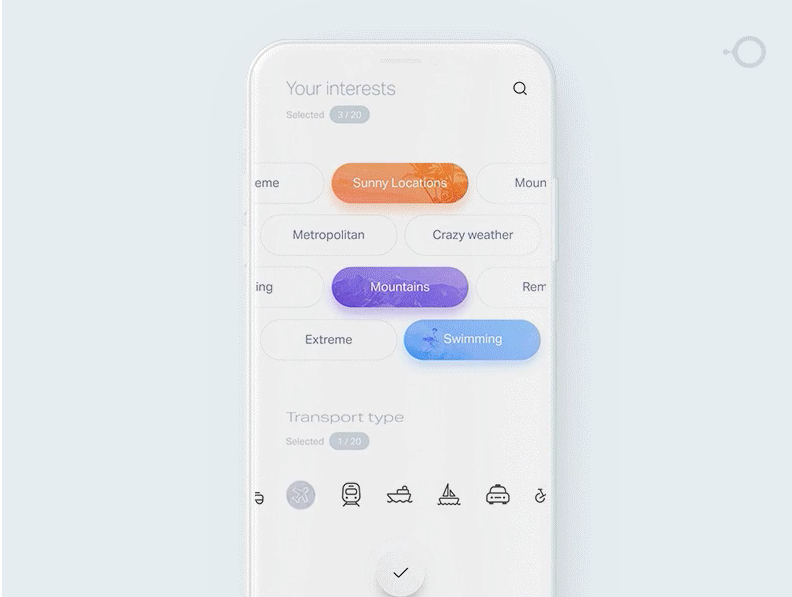

Onboarding/Feedback vragen/Reflectie maken  
Source:  
[http://ui-patterns.com/patterns/StepsLeft](http://ui-patterns.com/patterns/StepsLeft)

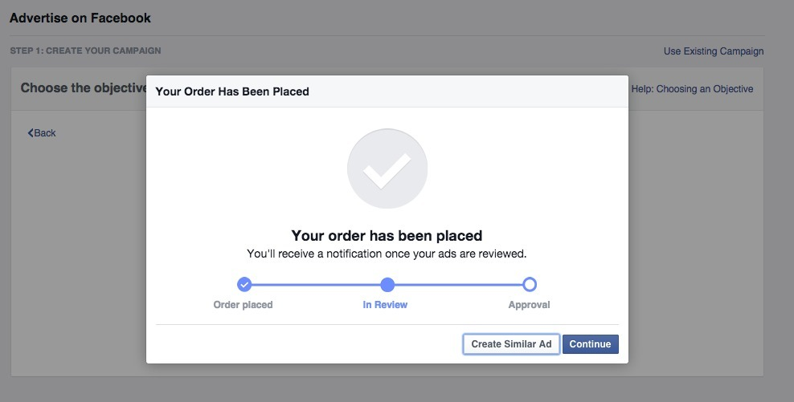

Reflectie onderwerpen  
Source: [http://ui-patterns.com/patterns/TagCloud](http://ui-patterns.com/patterns/TagCloud)

Onboarding  
Source: [http://ui-patterns.com/patterns/Tour/examples/19031](http://ui-patterns.com/patterns/Tour/examples/19031)

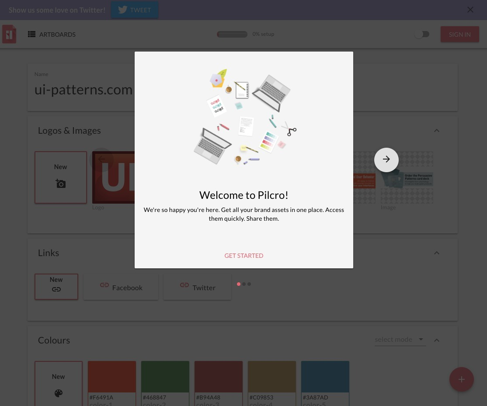

  
Horizontal Scrolling  
Source: [https://uxplanet.org/horizontal-scrolling-in-mobile-643c81901af3](https://uxplanet.org/horizontal-scrolling-in-mobile-643c81901af3)

New messages  
Source: [http://osxdaily.com/2012/01/09/remove-red-badge-icons-from-apps-ios/](http://osxdaily.com/2012/01/09/remove-red-badge-icons-from-apps-ios/)

