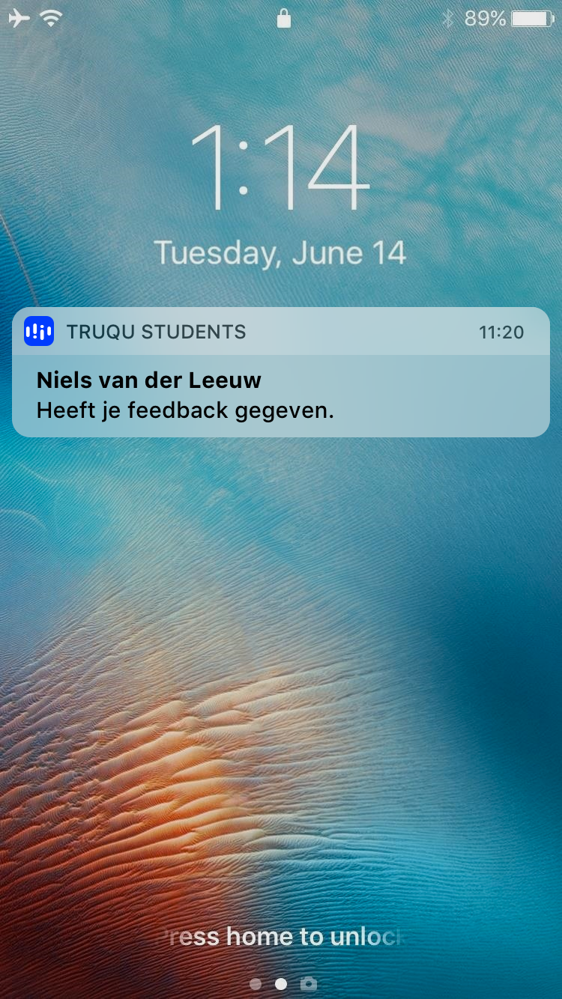

# Engagement

Studenten die gebruik hebben gemaakt van de tool Athena gaven aan dat zij nog wel is vergaten om elkaar of zichzelf feedback te geven of te beoordelen. Dit ging ten nadelen van hun eigen cijfer en die van andere. Dit heeft geleid tot de conclusie dat notificaties ontzettend belangrijk zijn in mijn applicatie.

Om er voor te zorgen dat de student actief bezig blijft met zijn ontwikkeling, heb ik gekeken naar hoe wij de gebruiker het beste kunnen stimuleren om feedback te vragen, te reflecteren of op de hoogte te brengen van nieuwe feedback verzoeken en antwoorden.

### Pushnotificaties

Uit een visualisatie van [Invesp](https://www.business2community.com/infographics/the-growing-importance-of-mobile-app-push-notifications-infographic-02096198) blijkt dat pushnotificaties er voor kunnen zorgen dat een gebruiker actief bezig blijft op een platform.

Een notificatie binnen een week na de eerste keer inloggen kan er voor zorgen dat een student het product voor 77% meer gebruikt in de twee maanden erna. 

Ik heb er voor gekozen om een aantal push-notificaties te introduceren die er voor zorgt dat de gebruiker op de hoogte wordt gesteld van nieuwe gebeurtenissen en een stukje engagement.

De notificaties:

* Je hebt een nieuw feedback verzoek ontvangen van \[Naam\], beantwoord deze nu!
* \[Naam\] heeft je feedback gegeven!
* Er is weer een periode van 10 weken voorbij. Is het misschien tijd om te reflecteren op deze periode?
* Je hebt al een tijdje geen feedback gevraagd, misschien is het tijd voor een nieuw verzoek?
* Je hebt deze maand al 10x feedback gevraagd! Ga zo door

Voorbeeld:  

