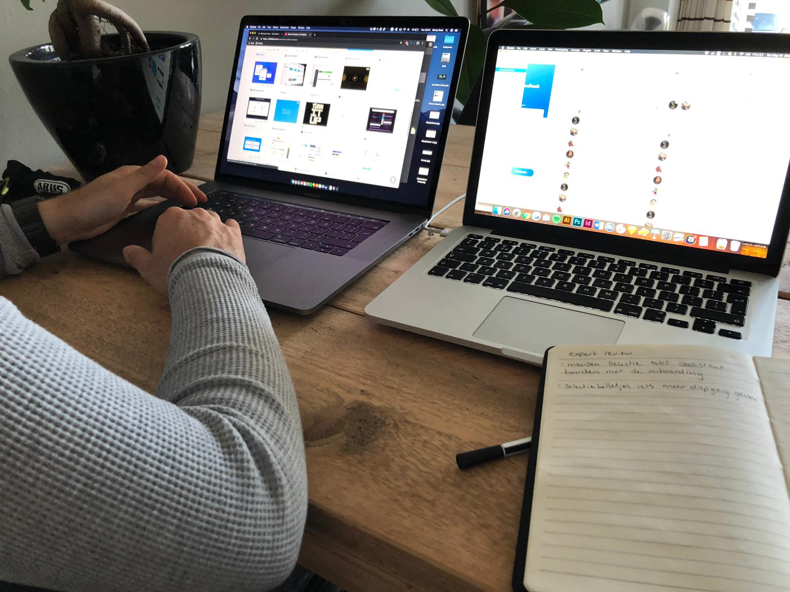
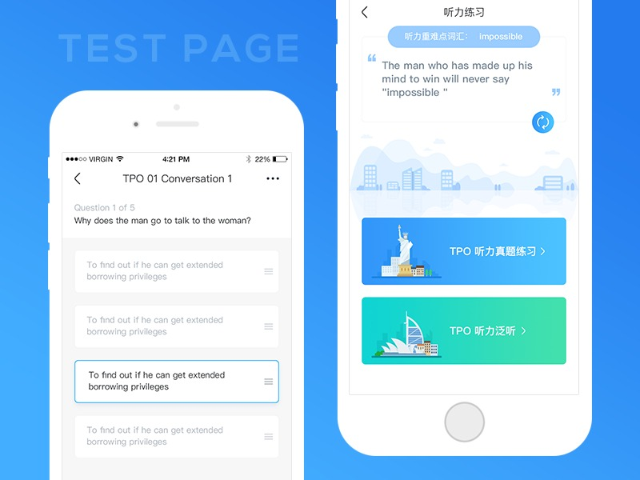
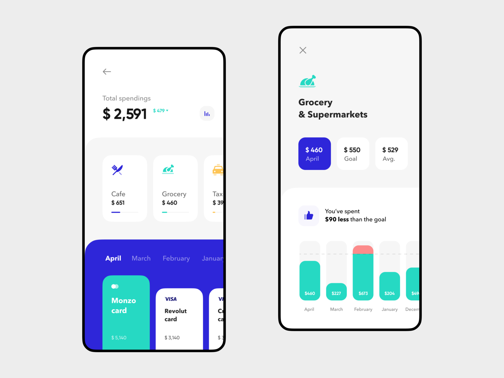
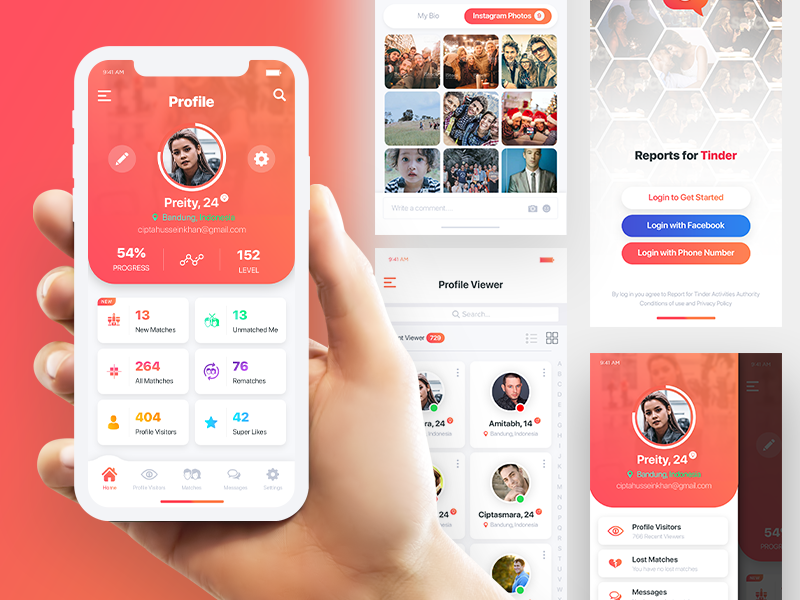
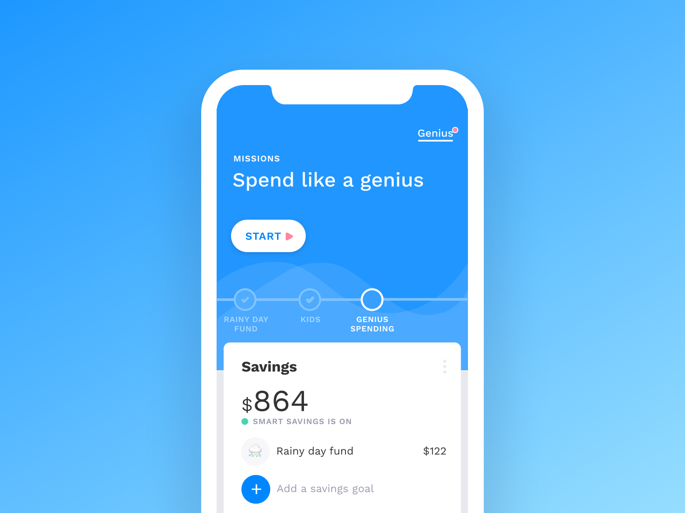

# Expert review Remy Gast

Remy heeft mij begeleid tijdens mijn stage en heeft in April afscheid genomen van TruQu. Hij heeft 3 jaar werkervaring opgedaan en is erg goed in het kijken naar de UX en UI van een product. Ik heb met hem afgesproken om te kijken naar mijn designs. Wij hebben de gehele flow doorlopen en zijn tot een aantal belangrijke punten gekomen die aangepast moeten worden. De punten die naar voren kwamen waren de volgende:

Resultaten:

* Je gebruikt verschillende selectie tabs tijdens de onboarding en bij het selecteren van mensen. Zorg er voor dat je een keuze maakt tussen een van deze twee. Dit zorgt voor meer consistentie
* Bij de onboarding heb je nu één grote knop voor volgende, maar als ik terug wil kan dat dus niet? Misschien moet je hier 2 knoppen voor maken.
* Je kunt je selectie indicatoren nog iets meer verbeteren. Probeer er iets meer diepgang aan te geven door middel van een schaduw, of maak gebruik van vinkjes.
* Zodra mensen een extern e-mail adres invullen moeten zij deze toevoegen. Zorg er voor dat je de mensen hier mee helpt. Dit kan door middel van een knop.
* Bij het toevoegen van een bijlage gebruik je een web pattern. Kijk of je hier iets van een knop van kan maken.
* Het selecteren van competenties en feedbackonderwerpen werkt erg makkelijk.
* Wanneer iemand achteraf nog competenties wilt koppelen of verwijderen ziet dat er nu een beetje raar uit. Ook de knoppen hier voor zijn te klein. Kijk of je hier bijvoorbeeld iets van chips van kunt maken.
* Het onderdeel persoonlijke ontwikkeling ziet er erg interessant uit. Probeer het iets meer te laten passen in de stijl die je hanteert over de gehele applicatie
* Kies er voor om je data inzichten of allemaal in een card te stoppen, of allemaal daar buiten. Consistentie is hier belangrijk.
* De bar chart past nog niet helemaal in de stijl. Je hanteert bijvoorbeeld ook geen ronde bars, terwijl alles een ronding heeft in je product
* Probeer de stijl van je app door te trekken over het gehele product. Soms ziet het er nog wat kaal uit.

Inspiratie:

### List select:

### Bar charts:

### Data insights

### Design

