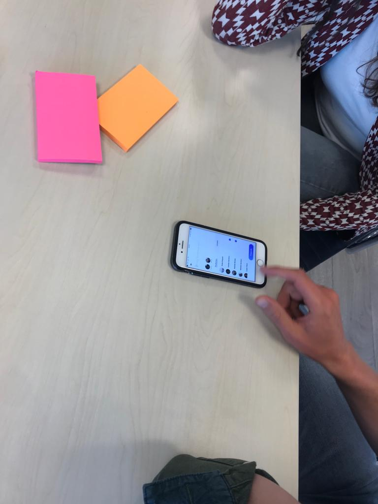

# Expert Review/Revisit Philip La Rose

Vanuit de gedachte dat ik als designer ideeën anders kan interperteren dan iemand die dat niet is, ben ik terug gegaan naar Philip met mijn uitgewerkte concept. Samen met zijn collega heeft hij deze doorlopen en gekeken wat er nog aan te verbeteren valt. De belangrijkste resultaten zijn hier onder terug te vinden:  

  

Resultaten:

* De onboarding is vrij duidelijk en ook goed dat je de student bij de hand neemt om elk onderdeel in te stellen.
* Na de onboarding kreeg ik de melding account aanmaken voltooid, dat is prima. De call to action zei "bevestig", dat vond ik een beetje vreemd. Misschien kun je dit veranderen.
* Je zou er over na kunnen denken om een select all te implementeren bij het vragen van feedback. Ik doe dit ook wanneer ik feedback vraag aan een organisatie
* Misschien kun je de gebruiker nog iets meer context kunnen geven bij het selecteren van competenties. Dit kan vrij simpel door middel van tekst
* Ik zou feedback eigenschappen veranderen naar feedback onderwerpen. Eigenschappen klinkt heel erg als een stempel
* Neem mee in je toekomstvisie dat leerdoelen meegenomen worden! Het is nu een vrij complete app hoor, maar dat zou hem helemaal perfect maken
* Bij de persoonlijke ontwikkeling vind ik de boom erg gaaf! Dit is een speelse manier van communiceren hoe je gebruiker er voorstaat. Erg cool!
* Baseer de grafiek bij persoonlijke ontwikkeling op bijvoorbeeld de feedback onderwerpen. Dit zorgt er voor dat je inzicht krijgt in je ontwikkeling! Die onderwerpen zijn een vrij uniek onderdeel aan je concept.
* Vanuit mijn expertise denk ik dat je app een erg waardevolle toevoeging zou kunnen zijn. We hebben natuurlijk eerder een interview gehad en je hebt de antwoorden goed ingevuld. Ga zo door en dan komt het zeker goed.

