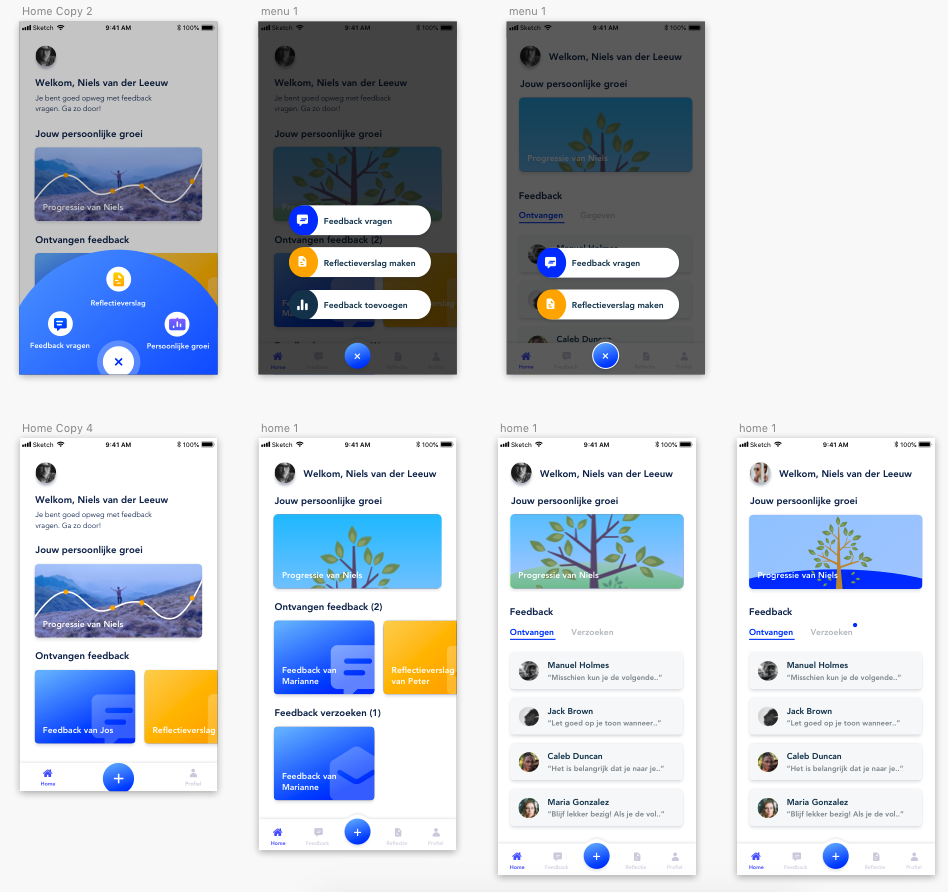

# Iteraties home & menu

Alle iteraties van het home scherm en het menu. Deze zijn veranderd in verloop van tijd veranderd op basis van design inspiratie, design pattern search, usabillity tests en expert review\(s\)

Menu van links naar rechts:

1. Uitklap menu met feedback vragen, reflectieverslag en persoonlijke groei
2. Uitschuif menu met feedback vragen, reflectie verslag maken en feedback toevoegen
3. Uitschuif menu met feedback vragen en reflectieverslag maken en de sluit knop iets meer contrast gegeven

Home van links naar rechts

1. Persoonlijke groei met grafiek en foto, 2 kaarten met ontvangen feedback en reflectieverslag, kleiner menu
2. Geupdate persoonlijke groei met kort zicht op de boom, extra kaart feedback verzoeken en uitgebreider menu
3. Afgestapt van de kaarten, tabs toegevoegd voor het selecteren van ontvangen feedback en feedback verzoeken, 4 recente feedback items
4. Persoonlijke groei in de kleur van de tool en een annotatie toegevoegd voor nieuwe feedback verzoeken

