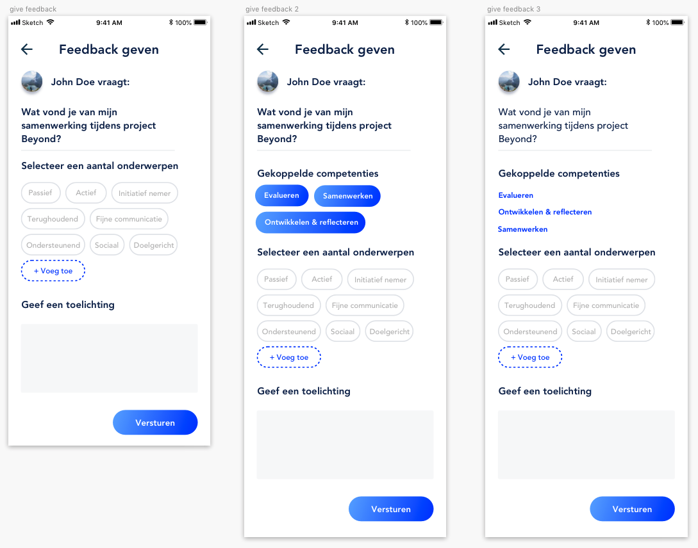
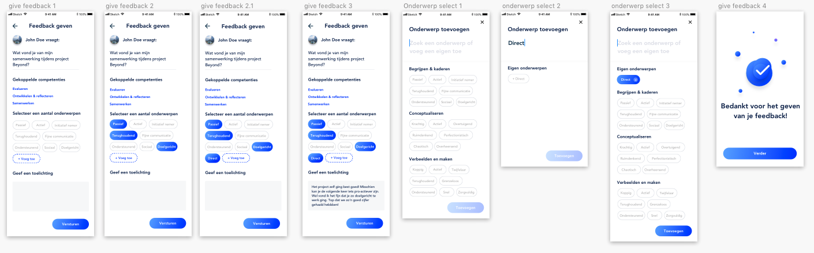

# Iteraties feedback geven

Alle iteraties van feedback geven. Deze zijn veranderd in verloop van tijd veranderd op basis van design inspiratie, design pattern search, usabillity tests en expert review\(s\)

Van links naar rechts:

1. Eerste idee uitgewerkt digitaal
2. Competenties aan feedback geven toegevoegd om meer context toe te voegen
3. Competenties iets aangepast zodat mensen niet verward worden dat het een selectie zou kunnen zijn.

Iteratie 4:

Toevoegen van eigen onderwerp toegevoegd.

