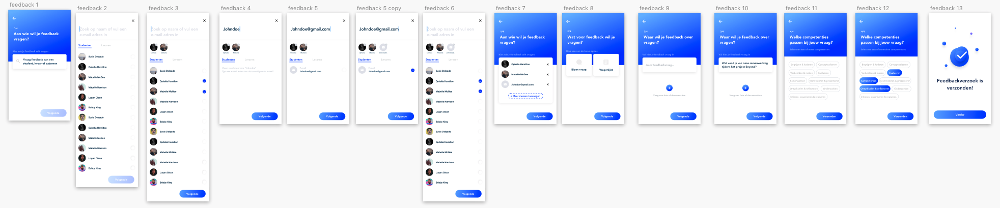

# Iteraties feedback vragen

Alle iteraties van feedback vragen. Deze zijn veranderd in verloop van tijd veranderd op basis van design inspiratie, design pattern search, usabillity tests en expert review\(s\)

**Iteratie 1**: eerste idee feedback vragen en competentie koppelen  
**Iteratie 2:** Meer huisstijl en feeling aan de flow gegeven, mensen selectie toegevoegd, keuze tussen enkele vraag of vragenlijst toegevoegd, ander pattern voor het toevoegen van documenten/foto's  
**Iteratie 3:** Mensen selecteren consistent gemaakt hoe dit eerder in het product gebeurd, toevoegen van externen toegevoegd, ander pattern voor toevoegen van documenten/foto's  
**Iteratie 4:** Ander pattern voor het toevoegen van externen, meer mensen selecteren knop consistent gemaakt hoe het door het gehele product wordt gedaan.

