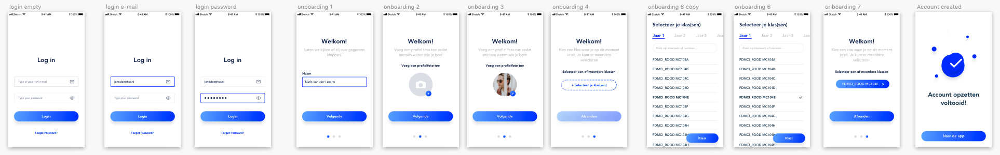
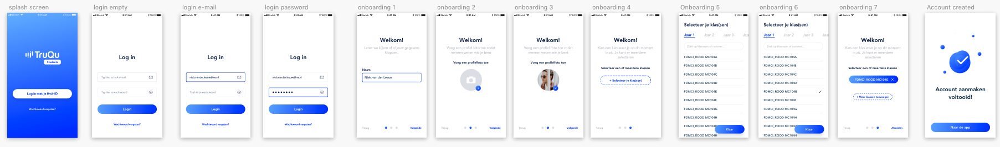

# Iteraties onboarding

Alle iteraties van onboarding. Deze zijn veranderd in verloop van tijd veranderd op basis van design inspiratie, design pattern search, usabillity tests en expert review\(s\)

**Iteratie 1:** eerste onboarding, instellen van je naam, foto en klas selecteren  
**Iteratie 2:** splash screen toegevoegd, state voor meer klassen toevoegen toegevoegd  
**Iteratie 3:** terugknop toegevoegd, klassen selecteren knop consistent gemaakt zoals gebruikt wordt door het hele product

