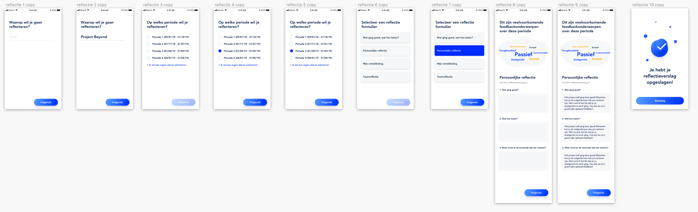

# Iteraties reflectie

Alle iteraties van reflectie. Deze zijn veranderd in verloop van tijd veranderd op basis van design inspiratie, design pattern search, usabillity tests en expert review\(s\)

**Iteratie 1:** Eerste concept met het opzetten van een reflectieverslag  
**Iteratie 2:** Het selecteren van een periode toegevoegd  
**Iteratie 3:** Stijl gehanteerd van feedback vragen, knop van eigen periode selecteren consistent gemaakt zoals wordt gebruikt in het hele product, bij de woordwolk een knop voor het bekijken van feedback toegevoegd

