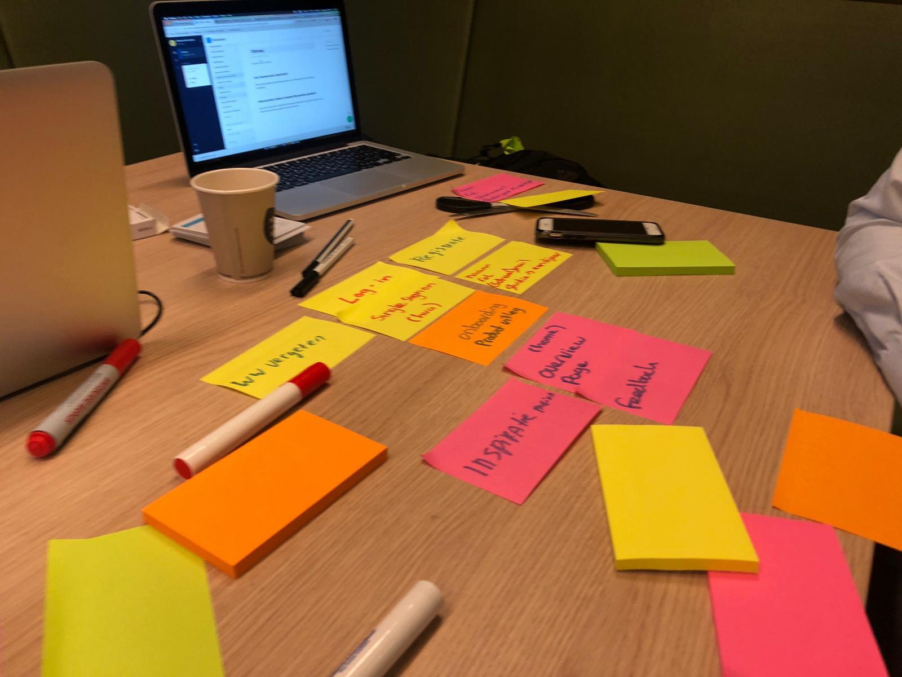
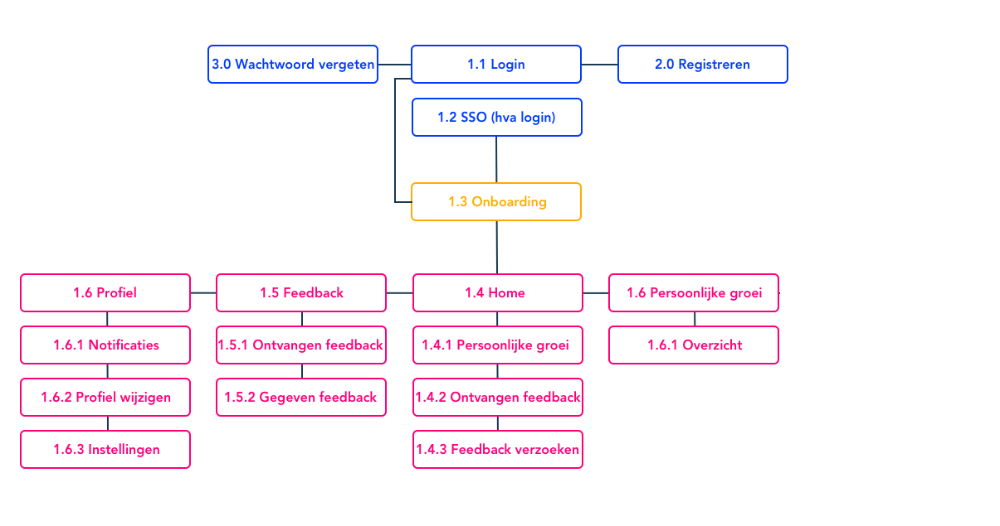
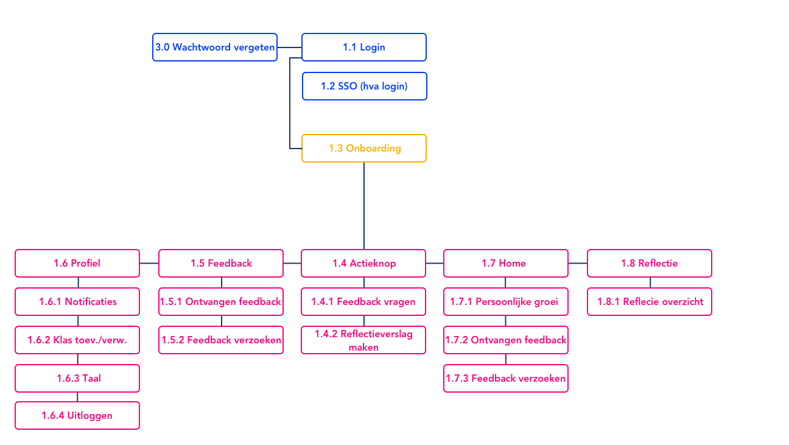

# Informatie architechtuur

## Plan van aanpak

Samen met Armand Bissesar heb ik een co-creatie met betrekking tot de informatie archtechtuur van mijn mobiele applicatie gehouden. Samen hebben wij een brainstorm sessie gedaan om te kijken welke elementen essentieel zijn voor mijn applicatie.

## De informatie architectuur v1.0

 

## De informatie architectuur v2.0

Op basis van onderzoek en interviews is mijn informatie architectuur iets veranderd. In de eerste versie is geen menu opgenomen en mist het onderdeel reflectie. Op basis van feedback vanuit mijn afstudeerbegeleider en groenlicht presentatie bleek reflectie toch een essentieel onderdeel te zijn.

Versie 2.0:

