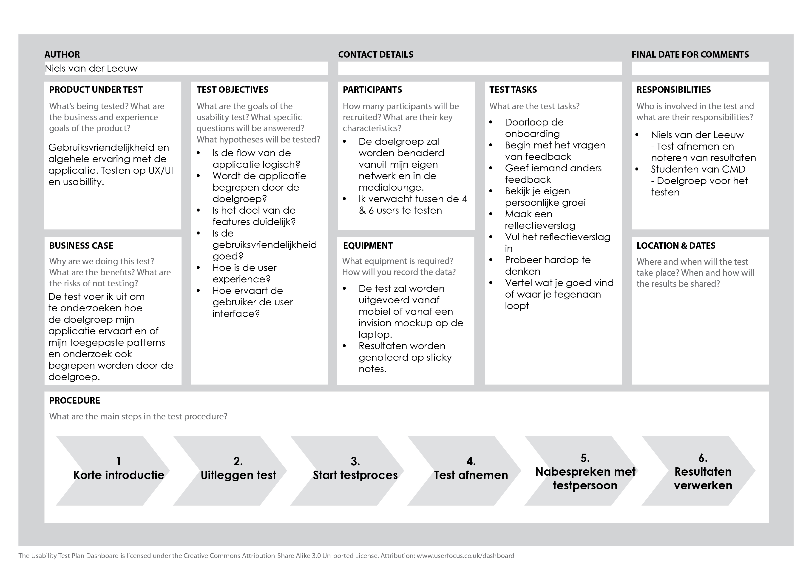

# Usabillity testing

Om mijn tests vorm te geven heb ik gekeken naar verschillende test methodes. Om in kaart te brengen hoe mijn test in zijn werk gaat, wat ik daar voor nodig heb en wat ik precies wil testen heb ik het "One page usabillity test" van [Medium ](https://medium.com/@userfocus/the-1-page-usability-test-plan-dbc8c3d7fb54)gebruikt.

Dit format heb ik ingevuld en ziet er als volgt uit:

Al mijn tests zijn onder deze hoofdpagina terug te lezen.

\_\_

