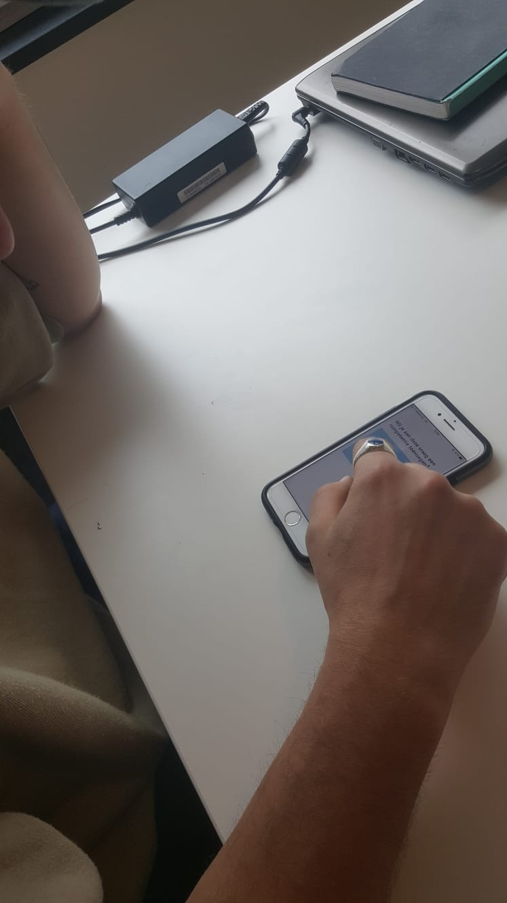

# Usabillity Test Dennis Vens

Usabillity test product \(Onboarding, feedback geven & feedback beantwoorden, reflectie en persoonlijke groei\).

* De knop voor het toevoegen van bijlage was voor mij niet duidelijk genoeg. Ik had niet door waar deze stond of dat deze er uberhaupt was. Ik denk dat je dat duidelijker in beeld kunt brengen.
* Het onderdeel reflectie vind ik erg interessant. Ik zou graag op de een of andere manier willen zien waar deze feedback woorden vandaan komen. Misschien dat je het mogelijk kunt maken om op de woorden te klikken, of hier een call to action aan toe te voegen. Op die manier kan ik tijdens het reflecteren nog even kort terugkijken op de gegeven feedback
* Het reflecteren op periode's van school vind ik erg goed. De mogelijkheid om zelf nog een datum te kunnen kiezen is ook erg handig, wanneer je een tussentijdse reflectie wilt doen bijvoorbeeld.
* Ik mis voor het inloggen nog een state waar ik bijvoorbeeld kan kiezen om in te loggen of mijn wachtwoord op te vragen.
* Home scherm is overzichtelijk. Misschien kun je de gebruiker nog duidelijk maken dat er openstaande feedbackverzoeken zijn door middel van een annotatie of iets dergelijks.
* Ik zou de persoonlijke groei iets meer basseren op de feedback die je hebt gehad. Je kunt bijvoorbeeld een grafiek inzichtelijk maken met de feedback onderwerpen die je terug gekregen hebt.

