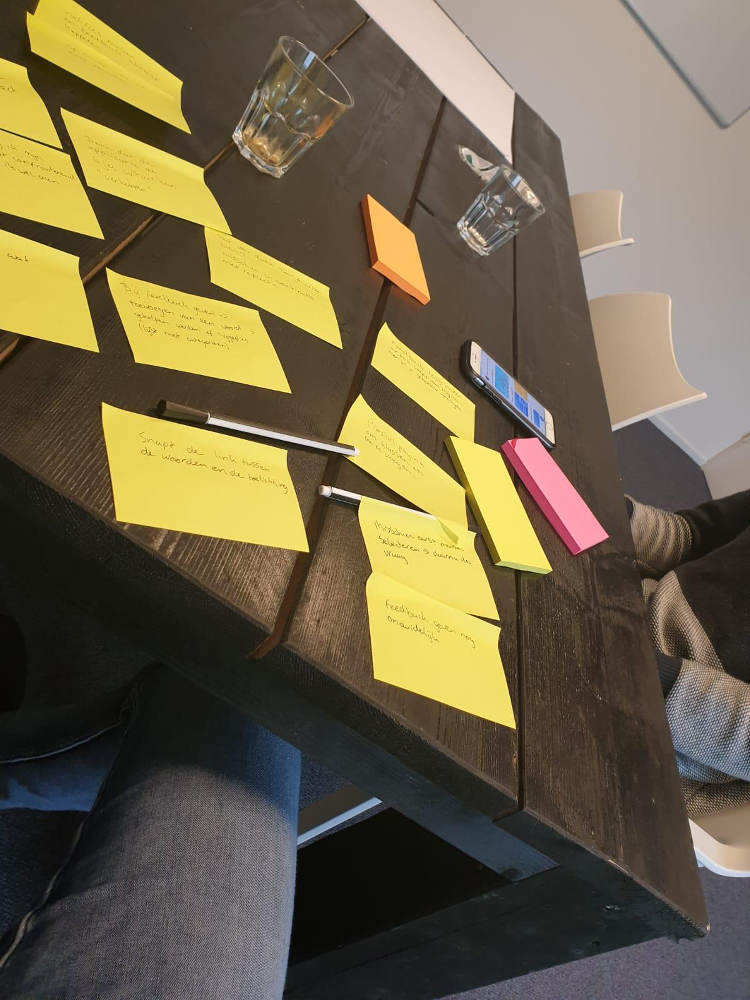

# Usabillity test Jorn van 't Hof

Usabillity test product \(Onboarding, feedback geven & feedback beantwoorden, persoonlijke groei\).

De usabillity test heb ik uitgevoerd met Jorn van 't Hof. Jorn studeert CMD in Amsterdam en zit in het tweede jaar.  

Uit de usabillity test zijn dit de belangrijkste inzichten:

* Bij de onboarding mis ik een state wanneer ik een klas geselecteerd heb om een extra klas toe te voegen
* De kaarten op het home scherm vind ik wat onduidelijk. Feedback geven aan iemand anders valt ook een beetje weg onderin. Misschien kun je hier iets anders voor bedenken
* Feedback geven is wellicht belangrijker. Denk er over na om de feedback verzoeken van andere mensen misschien bovenaan te zetten.
* Ik zou graag achteraf mijn feedback willen koppelen aan een project of vak
* Ik zou graag willen reflecteren op mijn feedback op een andere manier hoe school dat doet. De formats van school zijn vaak te algemeen en ook erg saai
* Ik zou graag elke 10 weken een herinnering willen hebben dat ik moet reflecteren op de afgelopen periode. Dit zijn ook de periode's dat wij vaak projecten en vakken doen.
* Ik denk dat deze applicatie de "zesjes" cultuur kan veranderen
* Ik zou graag een opname willen maken of een foto toevoegen als ik achteraf feedback toevoeg
* In Athena zag ik het gemiddelde van mijn resultaten. Dit was erg confronterend, maar hierdoor ging ik wel beter aan de slag. Ik denk dat data erg belangrijk is om terug te zien in het product
* De boom is nog wat nietszeggend, misschien kun je daar wat meer van laten zien. De data visualisatie vind ik interessant alleen zegt nog niet zoveel over mijn groei. Opzich is mijn acties goed om te zien hoe veel ik bezig ben met de app, maar die grafiek er onder zegt eigenlijk precies hetzelfde.
* Ik kan even niet meer op de naam komen maar in de les doen we wel eens iets met zo'n woordwolk. Misschien is dat interessant voor reflectie
* Ik zou misschien achteraf nog notities bij feedback willen zetten
* Bij het toevoegen van een feedback woord zou ik geholpen willen worden door de applicatie. Dit kan bijvoorbeeld in combinatie met de competentie lijst die school aanbied.
* De manier van feedback geven vind ik erg handig. Ik kan woorden selecteren die onderwerp van mijn feedback worden

