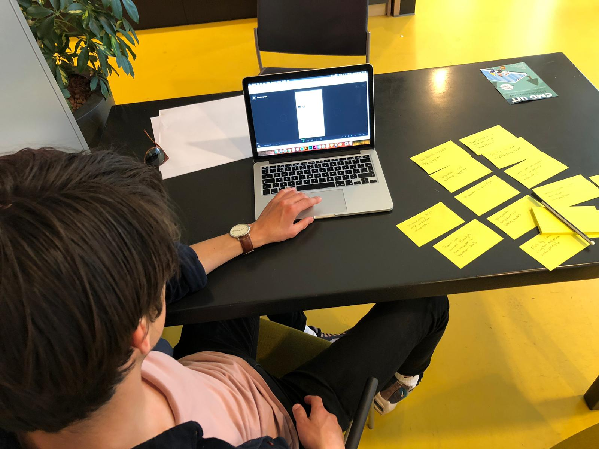

# Usabillity test Werner Hiemstra

Usabillity test product \(Onboarding, feedback geven & feedback beantwoorden, reflectie en persoonlijke groei\). 


_"Een super intressante tool. Ik denk dat zoiets erg waardevol had kunnen zijn tijdens mijn loopbaan. Op deze manier had ik denk ik nog meer uit mijn cmd loopbaan kunnen halen."_


De belangrijkste resultaten uit deze test waren:

* Ik zou de onboarding tekst misschien aanpassen naar het onderdeel waar je doorheen loopt
* Bij de boom denk ik dat die groeit op basis van mijn acties. Bijvoorbeeld hoe minder blaadjes hoe minder ik gedaan heb. De takken zouden kunnen staan voor competenties denk ik
* De grafieken bij het onderdeel persoonlijke groei geven waardevol inzicht in mijn groei denk ik. Goed dat je dat hebt gebasseerd op de onderwerpen die je ontvangt tijdens het vragen van feedback
* Ik zou de competenties achteraf niet willen koppelen of verwijderen. De feedback is al gegeven op basis van de meegestuurde competenties
* Misschien kun je voor de gekoppelde competenties iets andere labels gebruiken. Ik zie nu niet direct het verschil
* Ik snapte niet direct hoe het toevoegen van externe werkte. Misschien kun je iets anders dan die knop die naar voren komt doen. Wellicht iets wat met me meetypt
* Misschien kun je de placeholder voor het zoeken en toevoegen van externe iets aanpassen. Dat het iets duidelijker wordt hoe dat werkt.
* Misschien dat je in de grafiek bij jouw persoonlijke groei van de competenties zou kunnen doorklikken op het woord om te zien welke feedback er bij hoort.
* Ik zou filters willen zien bij mijn feedback overzicht. Die mis ik nu nog
* Ook bij het toevoegen van een feedback onderwerp zou ik iets anders doen dan de knop die je ook gebruikt voor het toevoegen van externe. Dit was ook niet duidelijk
* Ik vind het visuele verschil tussen labels, headers en tekst onduidelijk. Alles is dezelfde dikte
* Erg tof wat je gedaan hebt met het onderdeel reflectie. Ik begrijp waarom het handig zou kunnen zijn om veelvoorkomende onderwerpen terug te zien. Wel mis ik misschien nog iets van een mogelijkheid om terug te zien waar die onderwerpen vandaan kwamen. Misschien is een knop om te zien welke feedback hierbij hoort duidelijk.

