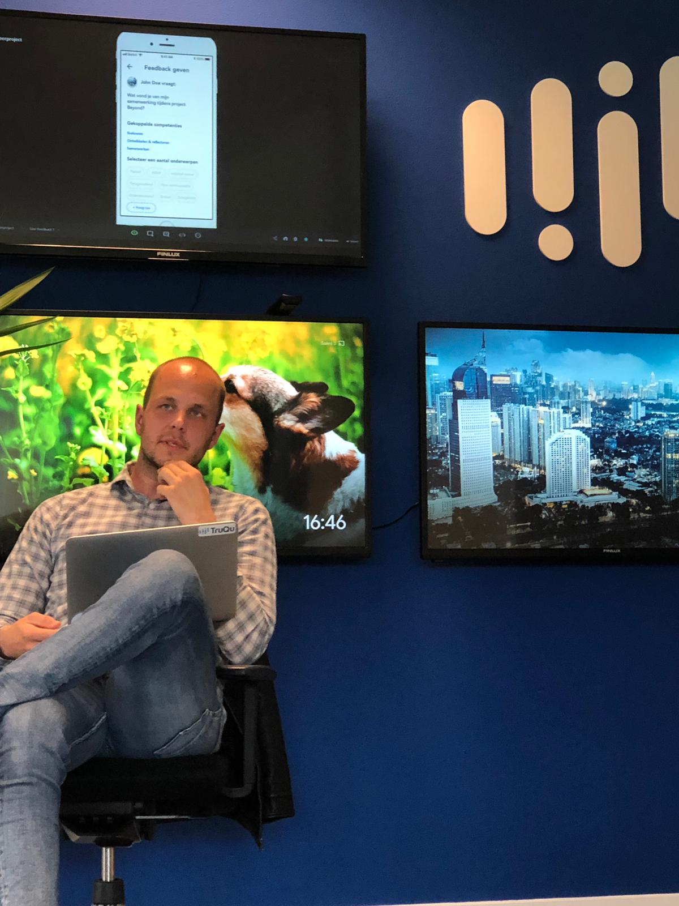

# Toekomstvisie

Door het tijdsbestek wat ik heb gekregen tijdens het afstuderen, is het van belang dat je prioriteiten stelt aan de eerste versie van je prototype. Ik heb ontzettend veel ideeën over deze tool, maar ik heb gekeken naar wat er écht belangrijk was om in 20 weken uit te werken. In deze toekomstvisie bespreek ik mijn toekomstige plannen voor deze tool die wellicht naar voren zijn gekomen in mijn onderzoek of mijn eigen ideeën.

Een aantal features die wellicht in de toekomst toegevoegd kunnen worden aan de tool zijn:

* In de toekomst moet de applicatie cross-platform worden. Voor de eerste versie van deze app is deze op mobile uitgewerkt, maar deze moet in de toekomst op zowel desktop, ipad en mobiel beschikbaar zijn.
* Er zou content kunnen worden aangeboden aan leerlingen door middel van video's en artikelen.
* In de toekomst moeten leraren hun eigen platform hebben binnen deze applicatie. 
* Studenten zouden elkaar feedback kunnen geven door middel van spraakmemo's
* Leerlingen kunnen leerdoelen aanmaken
* In de toekomst zou deze applicatie kunnen aansluiten op het SLC traject. Je zou de leraren toegang kunnen geven tot de persoonlijke groei van de leerlingen, waaruit zei kunnen opmeten hoe het met hun leerlingen gaat.
* Er zou een aparte leraren applicatie ontwikkelt kunnen worden waarbij zij de leerlingen nog beter kunnen helpen, begeleiden en voorzien van feedback.
* In een kort gesprek met David de Vries in de medialounge vertelde hij mij dat hij het belangrijk vond dat studenten zelf achteraf hun feedback kunnen toevoegen. Dit omdat je soms ook face to face feedbackgesprekken hebt. Een belangrijk onderdeel om mee te nemen in de toekomst is dus dat studenten hun ontvangen feedback van buiten de applicatie ook kunnen verwerken.
* Leraren zouden in de toekomst ook feedback kunnen vragen van leerlingen of collega's.

## Hoe nu verder?

Ik ben ontzettend trots en blij dat mijn product goed ontvangen wordt door zowel de opdrachtgever, mijn begeleiders als mijn medestudenten. Iedereen ziet de meerwaarde in van dit product en zou dit graag willen inzetten om te werken aan hun eigen ontwikkeling.

In de nabije toekomst ga ik in gesprek met TruQu over een invulling van mijn project. De CEO van TruQu is razend enthousiast over de applicatie en wilt hier graag aan verder werken. Hij geeft aan dat mijn project een grote inspiratie is voor zowel de huidige tool als de tool die in de toekomst voor studenten op de markt zal komen.


_"Je app ziet er fantastisch uit en werkt super fijn. Ik denk dat je de afgelopen tijd een hele mooie slag geslagen hebt voor zowel TruQu zelf als de toekomstige tool voor studenten. Door het helpen van de student door middel van het toevoegen van onderwerpen wordt feedback geven en vragen nog makkelijker. Dit is ook een mooie inspiratie voor TruQu zelf. Ook de koppeling met de competenties van school is erg goed! Graag wil ik met je in gesprek om te kijken hoe we hier verder invulling aan kunnen geven. Super mooie inspiratie voor ons als bedrijf. Top gedaan!"_

**Bart Kollau - CEO TruQu**


