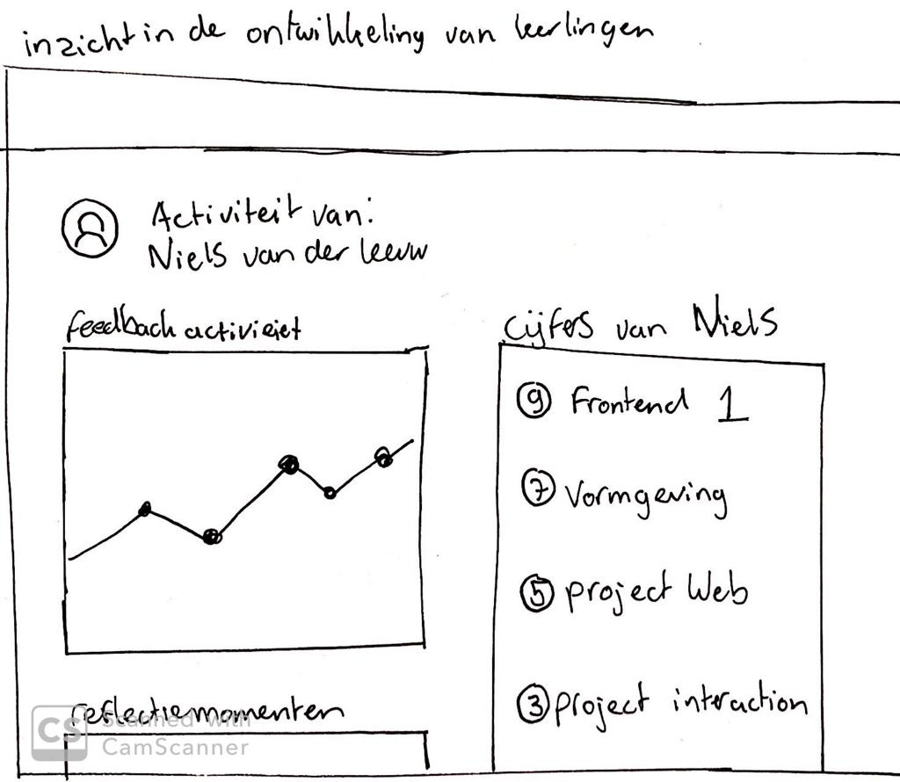
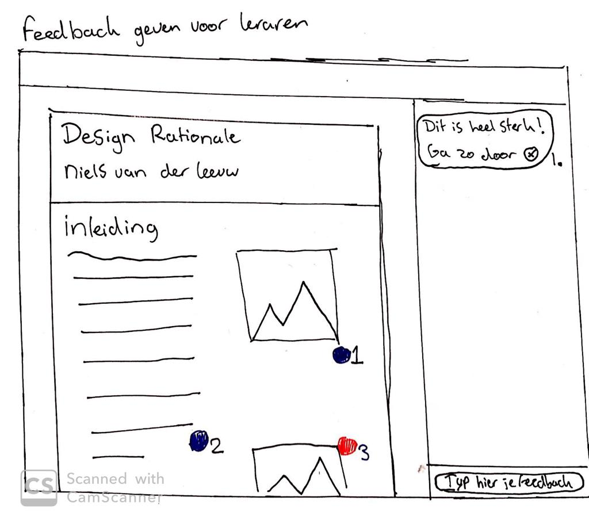

# TruQu students voor leraren

Vanuit mijn feedback frenzy kreeg ik de feedback dat Marianne en Annet benieuwd waren naar hoe een leraar de applicatie ervaart en wat mijn ideeën hier bij zijn. In mijn onderzoek heb ik een aantal leraren geinterviewd waar ook een aantal punten uit kwamen die ik hierin mee kon nemen.

Omdat mijn focus de afgelopen weken heeft gelegen op het ontwikkelen van TruQu voor studenten, heb ik een aantal korte schetsen gemaakt die een snel beeld geven van de ideeën die ik heb bij de leraren applicatie.

1. Inzicht in de ontwikkeling van studenten.

Via de applicatie zou een leraar inzicht kunnen krijgen in zijn SLC leerlingen, of leerlingen die hij les geeft. Op deze manier krijgt een leraar meer inzicht in de ontwikkeling van een student en kan hij/zij hier tijdens een feedback gesprek samen naar kijken. Op deze manier wordt het voor een leraar nog makkelijker om inzichtelijk te krijgen wat de gedragingen zijn van een leerling en kan dit ook helpen bij het beoordelings proces

2. Feedback geven aan studenten.

Tijdens mijn interview met Michel Alders gaf hij aan vaak feedback te geven op documenten van studenten. Een probleem tijdens het geven van deze feedback was dat hij vaak dezelfde feedback geeft op de studenten. Dit zou aangepakt kunnen worden door geschreven feedback te kunnen hergebruiken. Ook werd duidelijk dat Michel soms wel 3 of 4 applicaties tegelijk gebruikt om studenten feedback te geven of te beoordelen. Ik denk dat één centrale plek voor deze feedback/beoordeling momenten leraren zou kunnen helpen om gemakkelijker en sneller te werk te gaan.

